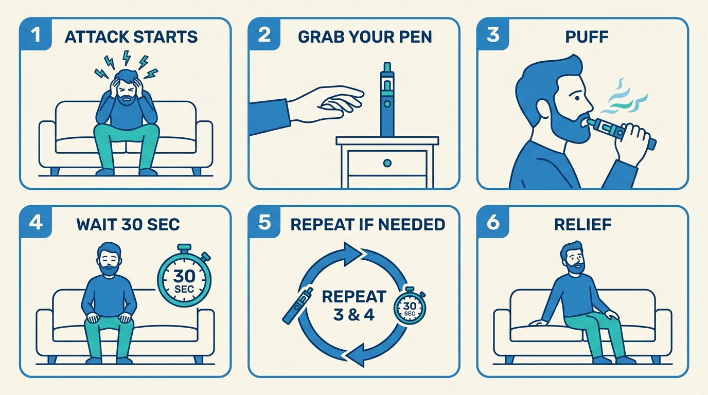

# Using DMT to Abort Cluster Headache Attacks
## A few puffs from a vape pen could stop your attack in seconds.

Vaped DMT acts almost instantly, wears off in minutes and carries minimal health risks at the doses used (provided you first check for [drug interactions](03-safety.md)).
It can be vaped with a standard vape pen, typically small enough to fit in your pocket.

For a growing community of patients, DMT has become an indispensable tool; sometimes the only thing that reliably stops the pain.
This guide was written for you: someone in serious pain, perhaps unfamiliar with DMT, looking for clear and comprehensive information.

DMT isn't a miracle cure — it's illegal in most countries, and it won't work for everyone.
Oxygen, while bulky and pricey, is the gold-standard legal abortive; many patients use it on its own or alongside DMT. Check out our oxygen guide (TBD).

---

## What aborting an attack looks like

Aborting means stopping an attack once it starts. Here's the procedure at a glance.

*From attack to relief in under a minute.*

You sit down, take a puff from a vape pen (a small handheld device that heats the DMT into a vapor you inhale), and hold it in for 15+ seconds before exhaling.
If the first puff works, you will notice it almost immediately.
Within seconds, the pain will have stopped.
If the pain hasn't stopped after 30 seconds, you can take another puff and hold it in again. 

Because each puff is small and fast-acting, you control the dose: you take only what you need to stop the pain, nothing more.

---

## Hear from patients

<!-- VIDEO CAROUSEL: 3-5 short clips (30-60s each) of cluster headache patients describing their experience using DMT to abort attacks. Horizontal scroll, autoplay-off, captions enabled. For now, let's use the John Fletcher video and a few of the text testimonials, including the patient headshots where available: https://clusterfree.org/testimonials -->

---

## What this guide covers

1. **[DMT Basics](02-dmt-basics.md)**: What DMT is, why it works for cluster headaches, and what it feels like at low doses.
2. **[Safety and Drug Interactions](03-safety.md)**: Which medications are dangerous to combine with DMT, and how to minimize risks.
3. **[FAQ](04-faq.md)**: Quick answers to the most common questions.
4. **[Preparing Your Vape Pen](05-preparing-your-dmt-vape-pen.md)**: Everything you need to buy and how to set it up, from scratch.
5. **[Aborting an Attack](06-aborting-protocol.md)**: The step-by-step protocol: how to inhale, how much to take, and what to expect.

---

*This guide is for informational and harm-reduction purposes only. It does not constitute medical advice. DMT is a controlled substance: illegal to possess, manufacture, or distribute in most countries, including the United States (Schedule I) and most of Europe. The authors of this guide do not encourage or condone illegal activity. Consult a qualified healthcare professional before making any changes to your treatment.*
