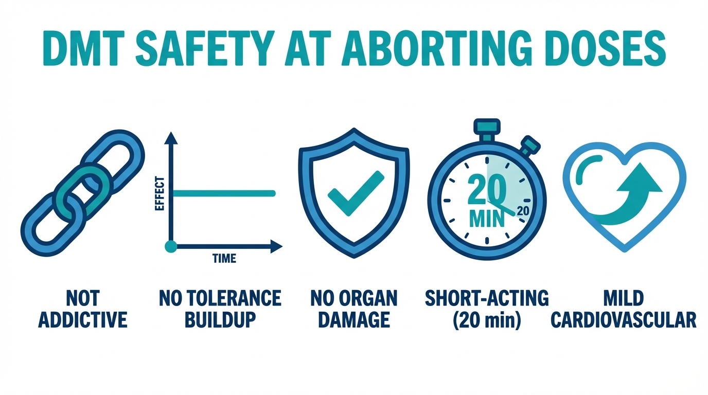

# DMT Basics: What You Need to Know

You've heard that DMT can stop cluster headache attacks. Before you go any further, you probably have questions — what is this stuff, is it safe, what will it feel like? This page gives you the essentials without overwhelming you with details.

---

## What is DMT?

**DMT** (short for **N,N-dimethyltryptamine**) is a molecule that occurs naturally in some plants — and in trace amounts in the human body. It's been used for centuries in South American traditional medicine and shamanism as part of ayahuasca, a plant brew. In recent years, researchers have begun studying DMT and related molecules for conditions like depression and PTSD.

When DMT is vaped (inhaled as a vapor from a small pen-like device), it acts within **seconds** and the effects are gone within **10–20 minutes**. This fast on, fast off profile makes it remarkably useful for aborting cluster headache attacks.

DMT is not a "street drug" in the way most people imagine. 
You cannot become addicted to it, and it is generally completely safe for the body, even at high doses.
That said, it is a **psychedelic** — at higher doses, it can profoundly alter your perception. The doses used for aborting attacks are much lower than recreational doses, so the effects are mild. More on that below.

---

## Why DMT for cluster headaches?

DMT acts on the brain's **serotonin system** — the same system involved in cluster headaches, and the same system targeted by triptans (like sumatriptan). Cluster headache patients have reported that inhaling a small amount of DMT can stop an attack in seconds.

**This is not an FDA-approved treatment.** The evidence comes from patient reports, not clinical trials. But for many patients, DMT has become a critical tool — especially when other options fall short.

Here's how it compares to what you might already be using:

<!-- | Feature | Sumatriptan (subcutaneous) | High-Flow Oxygen | Inhaled DMT |
|---|---|---|---|
| **Onset of Action** | **10–15 mins** | **15–20 mins** | <30 seconds |
| **Rebound Risk** | **Present** | None | None reported |
| **Daily Use Limit** | **Strict (cardiovascular risks)** | None | None if not on drugs at risk of causing bad interactions |
| **Logistical Viability** | High (injection) | **Low (tank)** | High (small vape pen) |
| **Legal Status** | Prescription | Prescription | **Illegal in most countries** | -->

*Side-by-side comparison of the three main options for aborting cluster headache attacks.*

---

## Is it safe?

At the low doses used for aborting attacks, DMT is generally **low-risk**. Here are the key facts:

- **Not addictive.** DMT does not cause physical dependence, and people don't develop cravings for it.
- **No tolerance buildup.** Using DMT repeatedly doesn't make it less effective.
- **No known organ damage.** Unlike alcohol or many medications, DMT is not toxic to the brain, liver, or other organs.
- **Short-acting.** Effects last 10–20 minutes. By 20–30 minutes, you should feel back to normal.
- **Mild cardiovascular effects.** DMT temporarily raises your heart rate and blood pressure — comparable to climbing a flight of stairs quickly. For healthy individuals, this is not a concern. If you have a heart condition or high blood pressure, talk to your doctor first.

*DMT's safety profile at the low doses used for aborting attacks.*

### The real risks

- **Drug interactions.** This is the biggest safety concern. Some medications combined with DMT can be dangerous. **If you take lithium, do not take DMT — the combination can cause seizures.** Other medications (especially MAOIs and SSRIs) may also interact. You must check the [drug interactions page](#) before your first use.

- **Anxiety at higher doses.** If you accidentally take more than intended, you might feel anxious. Overwhelming anxiety or anpanick attack is uncommon at aborting doses, and always passes within 10–20 minutes. The [aborting protocol](06-aborting-protocol.md) is specifically designed to prevent this — you take tiny amounts, one puff at a time.

- **Not recommended if you have a psychotic disorder** (e.g., schizophrenia) or a close family history of one.

> **The bottom line:** DMT is not risk-free, but the risks are manageable and well-understood. The main thing you need to do is check your medications for interactions — especially lithium. If you're clear on interactions, the low doses used here carry very little risk.

---

## What will it feel like?

This is the question most people are nervous about. Here's what to expect at the low doses used for aborting attacks.

### At aborting doses

The protocol uses small puffs, added one at a time — you might need one, you might need a few. Most people feel some combination of:

- A **warm, tingling sensation** spreading through the body — patients call this the "body buzz." It often starts in the chest.
- A feeling of **heaviness**, like gravity just increased slightly.
- Possibly some **mild closed-eye visuals** — soft patterns or colors if you close your eyes.
- A sense of **calm**.

*What most people feel at the low doses used for aborting attacks.*

That's usually it. Many people describe it as "pleasant but unremarkable." You remain aware of where you are, who you are, and what's happening. You can talk, move, and think clearly.

### How the timing works

- **0–10 seconds:** You feel the first effects (body buzz, warmth).
- **1–5 minutes:** Effects are at their strongest — still mild at these doses.
- **10–20 minutes:** Effects fade.
- **20–30 minutes:** Back to normal, with no or barely any lingering effects.

*Aborting doses are at the low end of the spectrum — nowhere near a full psychedelic experience.*

### What you won't experience at these doses

- You won't "trip." No hallucinations, no losing touch with reality.
- You won't feel out of control. The puff-wait-repeat protocol means you decide how much to take, one small step at a time.
- You won't be incapacitated. After 20–30 minutes, you're back to normal.

### If you accidentally take too much

At higher doses (which is unlikely with the puff-wait-repeat method), DMT can cause more intense effects: vivid visual patterns with eyes open, time distortion, or strong emotions. This can feel overwhelming if you're not expecting it. **The most important thing to remember: it will be completely over in 10–20 minutes.** You cannot get "stuck" in the experience.

The [aborting protocol](06-aborting-protocol.md) explains how to handle this in detail, including grounding techniques and what your sitter should do.

> **Important:** We strongly recommend that your first time using DMT is a **practice session** — not during an attack. Practice when you're calm and pain-free, with a sitter present, so you know what to expect before you need it in an emergency. The [aborting protocol](06-aborting-protocol.md) walks you through this.

---

## Common questions

**"Will I get addicted?"**
No. DMT is not addictive. It doesn't create cravings or physical dependence.

**"Will I hallucinate?"**
At the small doses used for aborting attacks, it's very unlikely. You might see mild patterns with your eyes closed — that's the most common visual effect. With eyes open, things will look normal.

**"Is it legal?"**
DMT is illegal in most countries. This guide does not encourage breaking the law. We present the medical information so you can make informed decisions about your own health.

**"Can I use it for every attack?"**
Yes. DMT is cleared from your body within minutes. There's no buildup from repeated use, and no limit on how many times per day you can use it.

**"What if I'm on medication?"**
You **must** check for drug interactions before trying DMT. This is not optional. Some combinations — especially lithium — are genuinely dangerous. See the [drug interactions page](#) for a complete list.

**"Do I need someone with me?"**
For your very first time, yes — you need a sober **sitter** (someone who stays with you while you use it). After you've practiced once and know how DMT feels, a sitter is recommended but not strictly required. The [aborting protocol](06-aborting-protocol.md) has full details on sitters.

**"What about psilocybin (magic mushrooms)?"**
You may have heard that psilocybin can also help with cluster headaches. That's true — psilocybin has shown promise for reducing the frequency of cluster cycles (a preventive effect). DMT is different: it's used to abort individual attacks as they happen. Some patients use both — psilocybin to reduce how often cycles occur, DMT to stop attacks when they break through. This guide focuses on DMT.

---

## Where to go next

- **Check your medications first.** If you take any medication, supplement, or herbal remedy, read the [drug interactions page](#) before anything else.
- **Ready to prepare your equipment?** The [preparation page](05-what-youll-need.md) walks you through buying a vape pen and mixing the liquid — about 30 minutes of active work.
- **Ready to use it?** The [aborting protocol](06-aborting-protocol.md) covers your first practice session and the step-by-step method for stopping attacks.
