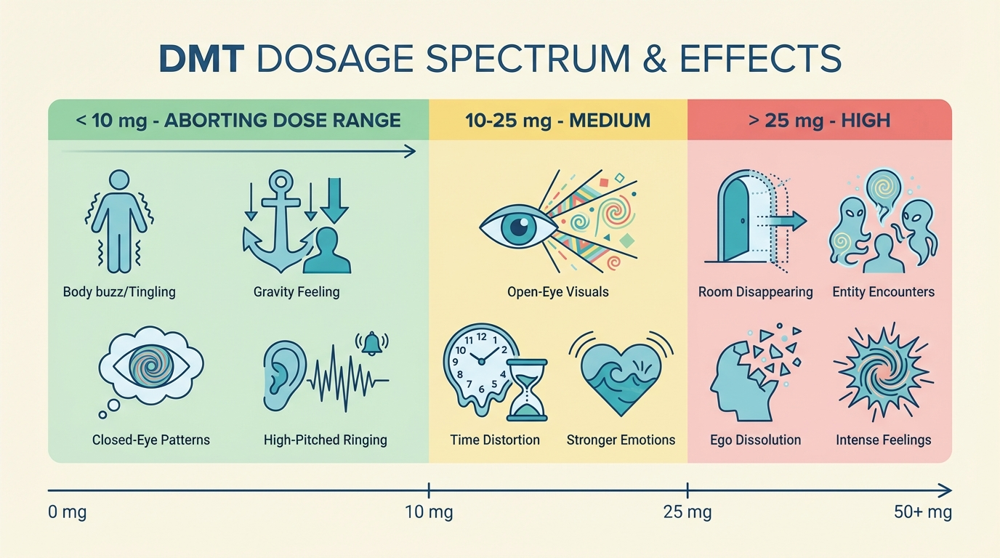

# Safety and Drug Interactions

Before you use DMT to abort a cluster headache attack, you need to understand the safety risks — especially drug interactions. This page is detailed because it needs to be. Some combinations of DMT with other medications are genuinely dangerous. Other risks are minimal and easy to manage.

**The good news:** For most people, the main safety concern is simply checking that your medications don't interact with DMT. If you're not on any medications, the risks are very low.

**What this page covers:**
- The critical rule you must follow (lithium)
- Drug interactions and how to check for them
- Serotonin syndrome: what it is, symptoms, and what to do
- Psychological and physical effects at different doses
- Who should avoid DMT entirely

---

## The Critical Rule

Before anything else, you need to know this:

> **If you take lithium (brand names: Lithobid, Eskalith, Lithane), do not take DMT.**
>
> The combination can cause seizures. This is not a theoretical risk — it is a documented, serious interaction. If you take lithium, DMT is not an option for you. There are no workarounds.

If you're taking *any other medication, supplement, or herbal remedy*, keep reading. Most interactions are manageable, but you need to check first.

---

## Understanding Drug Interactions

DMT affects the brain's serotonin system — the same system that many medications target. When you combine DMT with certain drugs, they can interact in ways that are harmful.

The main risks are:
1. **Seizures** (with lithium specifically)
2. **Serotonin syndrome** (with drugs that increase serotonin levels)
3. **Cardiovascular stress** (with drugs that affect blood vessels)

**The most important thing you can do:** Make a list of everything you're currently taking — prescription medications, over-the-counter drugs, supplements, herbal remedies — and check each one against the categories below. When in doubt, talk to your doctor before trying DMT.

### Lithium (Seizure Risk)

**What it is:** Lithium is a mood stabilizer used primarily to treat bipolar disorder.

**Why it's dangerous:** The combination of lithium and DMT can cause seizures. This is a well-documented interaction.

**What to do:** If you take lithium, do not take DMT. There is no safe way to combine them. If cluster headaches are severely impacting your life and you're considering DMT, talk to your psychiatrist about whether there are alternative medications for your bipolar disorder — but do not stop taking lithium without medical supervision.

---

### MAOIs (High Serotonin Syndrome Risk)

**What they are:** MAOIs (monoamine oxidase inhibitors) are a class of medications that slow down the breakdown of serotonin in the brain. They're used to treat depression (especially treatment-resistant depression), and they're also found in some plant-based preparations used in psychedelic contexts.

**Why they're dangerous:** MAOIs make DMT much stronger and longer-lasting. What would normally be a 10–20 minute experience can become a 2–4 hour intense psychedelic trip. More importantly, the combination significantly increases the risk of **serotonin syndrome** — a serious condition caused by too much serotonin in the brain. Serotonin syndrome can cause high fever, muscle rigidity, confusion, and in severe cases can be life-threatening.

**Common MAOIs include:**
- **Prescription antidepressants:** phenelzine (Nardil), tranylcypromine (Parnate), isocarboxazid (Marplan), moclobemide (Manerix)
- **Certain antibiotics:** isoniazid, linezolid
- **Plant-based MAOIs:** ayahuasca (contains harmine/harmaline), Syrian rue (Peganum harmala), and some "changa" blends

**What to do:**
- If you're taking a prescription MAOI for depression, **do not take DMT without talking to your doctor first.** The risk is serious.
- If your doctor approves trying DMT, you **must have a sitter present** — someone who understands the symptoms of serotonin syndrome and knows when to call for medical help (see the [serotonin syndrome section](#what-is-serotonin-syndrome) below).
- If you've used plant-based MAOIs (ayahuasca, Syrian rue), wait at least two weeks before taking DMT in any other form. MAOIs can stay in your system for days.

---

### SSRIs and SNRIs (Moderate Serotonin Syndrome Risk)

**What they are:** SSRIs (selective serotonin reuptake inhibitors) and SNRIs (serotonin-norepinephrine reuptake inhibitors) are common antidepressants. They work by increasing serotonin levels in the brain.

**Why they interact:** When combined with DMT (which also affects serotonin), there's a risk of serotonin syndrome. The risk is generally lower than with MAOIs, but it's not zero — especially if you're taking other serotonergic drugs as well (see [multiple drug combinations](#multiple-drug-combinations) below).

**Common SSRIs include:**
- Citalopram (Celexa)
- Escitalopram (Lexapro)
- Fluoxetine (Prozac)
- Fluvoxamine (Luvox)
- Paroxetine (Paxil)
- Sertraline (Zoloft)

**Common SNRIs include:**
- Venlafaxine (Effexor)
- Duloxetine (Cymbalta)
- Desvenlafaxine (Pristiq)

**Other medications in this category:**
- Certain tricyclic antidepressants (TCAs): clomipramine (Anafranil), imipramine (Tofranil)
- Certain opioid painkillers: tramadol (Ultram), methadone, meperidine (Demerol), fentanyl (but *not* morphine)
- Dextromethorphan (DXM) — a cough suppressant found in many over-the-counter cold medicines
- St. John's Wort (an herbal supplement often used for mild depression)

**What to do:**
- **Talk to your doctor** before trying DMT if you're taking any of these medications.
- **Have a sitter present** for at least your first few times using DMT. Make sure your sitter knows the symptoms of serotonin syndrome (see below) and when to call for help.
- If you've recently stopped taking an SSRI or SNRI, check the medication's half-life — some stay in your system for weeks. Fluoxetine (Prozac), for example, has a very long half-life. Ask your doctor how long to wait.

---

### Triptans (Low-Moderate Cardiovascular Risk)

**What they are:** Triptans are medications used to abort cluster headache and migraine attacks. Common ones include sumatriptan (Imitrex), rizatriptan (Maxalt), and zolmitriptan (Zomig).

**Why they interact:** Triptans narrow blood vessels in the brain. DMT temporarily raises your heart rate and blood pressure. Taking them together puts extra strain on your cardiovascular system.

**What to do:**
- **Avoid taking DMT within 24 hours of taking a triptan.** This gives your body time to clear most of the triptan from your system (roughly 5 half-lives for most triptans).
- If you're in an active cluster cycle and using triptans frequently, talk to your doctor about whether DMT is a safe option for you. Some patients use DMT as a replacement for triptans, which avoids the interaction entirely.

**Note on serotonin syndrome:** While triptans do affect serotonin receptors, they're considered unlikely to cause serotonin syndrome when combined with DMT (see [here](https://www.cfp.ca/content/64/10/720) and [here](https://en.wikipedia.org/wiki/Triptan#Interactions)). The main concern is cardiovascular, not serotonin syndrome.

---

### Multiple Drug Combinations

Even if each medication you're taking has a "low" risk when combined with DMT, taking *multiple* serotonergic drugs at the same time can make serotonin syndrome more likely. The effects stack up.

**Example:** If you're taking an SSRI, dextromethorphan (cough medicine), and St. John's Wort (herbal supplement), each one increases serotonin in a slightly different way. Add DMT on top of that, and the risk increases significantly.

**What to do:**
- **Make a complete list** of everything you're taking — prescriptions, over-the-counter medications, supplements, herbal remedies.
- **Research each one.** Check whether it affects serotonin. If you're not sure, assume it does and ask your doctor or pharmacist.
- **Talk to your doctor** about the full combination before trying DMT.
- **Have a sitter** for your first few times, especially if you're on multiple medications.

---

### Other Medications and Substances

If you're taking something that isn't listed above, don't assume it's safe. Do your own research:
- Search online for "[medication name] + serotonin" or "[medication name] + DMT"
- Ask your doctor or pharmacist
- Check drug interaction databases like [Drugs.com](https://www.drugs.com/drug_interactions.html)

Substances to be especially cautious with:
- **Amphetamines** (Adderall, Vyvanse) — serotonin releasers
- **MDMA / Ecstasy** — serotonin releaser, high risk
- **Cocaine** — cardiovascular risks
- **Alcohol** — can amplify negative psychological effects

---

## Drug Interactions Summary Table

Here's a quick reference for the main categories covered above:

| Drug Category | Examples | Risk Level | What To Do |
|---------------|----------|------------|------------|
| **Lithium** | Lithobid, Eskalith | **Very High (Seizure)** | **Do not take DMT** |
| **MAOIs** | Phenelzine (Nardil), tranylcypromine (Parnate), ayahuasca, Syrian rue | **High (Serotonin Syndrome)** | Talk to doctor. Must have sitter. Know serotonin syndrome symptoms. |
| **SSRIs / SNRIs** | Fluoxetine (Prozac), venlafaxine (Effexor), sertraline (Zoloft) | **Medium (Serotonin Syndrome)** | Talk to doctor. Have sitter for first few times. Know symptoms. |
| **Triptans** | Sumatriptan (Imitrex), rizatriptan (Maxalt) | **Low-Medium (Cardiovascular)** | Wait 24 hours after last triptan dose. Talk to doctor if using frequently. |
| **Multiple serotonergic drugs** | Any combination of above | **Variable (Serotonin Syndrome)** | Talk to doctor. List everything you're taking. Have sitter. |
| **Other / Unknown** | Anything not listed | **Unknown** | Research it. Talk to doctor. Have sitter first time. |

---

## What is Serotonin Syndrome?

Serotonin syndrome is a condition that happens when the brain has too much serotonin. It's most likely to occur when you combine DMT with MAOIs or with multiple other serotonergic drugs.

**Important to understand:** Serotonin syndrome is *dose-dependent*. That means it's hard to predict in advance whether a specific combination will trigger it — it depends on how much of each drug you've taken and when. That's why having a sitter is so important, especially if you're on any medications that affect serotonin.

### Recognizing the Symptoms

Serotonin syndrome symptoms range from mild to severe. It usually develops quickly — within minutes to hours after taking DMT.

**Emergency symptoms — call 911 / 112 / 999 immediately if you see:**
- **Seizure** (uncontrolled shaking, loss of consciousness)
- **High fever** (temperature above 38.5°C / 101.3°F, feeling very hot, heavy sweating)
- **Loss of consciousness** (passing out, can't be woken up)
- **Severe muscle rigidity** (muscles extremely stiff, can't move)
- **Rapid irregular heartbeat combined with looking very unwell** (chest pain, difficulty breathing, extreme confusion)
- **Milder symptoms that are rapidly getting worse** (within minutes)

**Non-emergency symptoms — call your doctor if you have:**
- Agitation or restlessness
- Confusion or disorientation
- Dilated pupils
- Rapid heart rate (faster than normal, but steady)
- Heavy sweating
- Shivering or goosebumps
- Muscle twitching or jerking
- High blood pressure
- Diarrhea
- Headache

Many of these symptoms (rapid heartbeat, sweating, dilated pupils) are also normal effects of DMT at any dose. The key difference is **severity and combination**. If you have several of these symptoms together, especially if they're severe or getting worse, that's when serotonin syndrome becomes a concern.

### What To Do

**If you suspect serotonin syndrome:**

1. **Stop taking DMT** (and any other serotonergic drugs).
2. **Assess the severity** using the list above.
3. **If symptoms are severe or rapidly worsening, call emergency services immediately.**
   - Tell them you took DMT and list any other medications you're on. Medical professionals need accurate information to treat you correctly.
4. **If symptoms are mild and stable, call your doctor** for advice. Don't take more DMT or other serotonergic drugs until you've been cleared.

**If you took MAOIs:** Stay with a sitter for at least **one hour** after taking DMT. MAOIs prolong the effects of DMT and can delay the onset of serotonin syndrome.

**For sitters:** See the [quick reference card for sitters](#quick-reference-for-sitters) at the end of this page.

### Additional Resources

For more information on serotonin syndrome:
- [Demystifying Serotonin Syndrome (Canadian Family Physician)](https://www.cfp.ca/content/64/10/720) — includes a [patient info sheet](https://www.cfp.ca/content/cfp/suppl/2018/10/11/64.10.720.DC1/720_SS_Infographic_Patient.pdf)
- [Cleveland Clinic: Serotonin Syndrome](https://my.clevelandclinic.org/health/diseases/17687-serotonin-syndrome)
- [Mayo Clinic: Serotonin Syndrome](https://www.mayoclinic.org/diseases-conditions/serotonin-syndrome/symptoms-causes/syc-20354758)

---

## Psychological Effects: What to Expect at Different Doses

One of the most common fears about DMT is "What will it feel like? Will I lose my mind?" The answer depends entirely on the dose. The [DMT basics page](02-dmt-basics.md) covers this briefly; this section goes into more detail.

The table below shows approximate dose ranges and their typical effects. **These are rough guidelines** — exact thresholds vary from person to person, depending on body weight, metabolism, vape settings, and other factors.

| Dose Range | Typical Effects | Likelihood at Aborting Doses |
|------------|-----------------|------------------------------|
| **Low (< 10 mg)** | Body buzz, gravity feeling, closed-eye visuals, high-pitched ringing | **This is the target range for aborting attacks** |
| **Medium (10-25 mg)** | Intense open-eye visuals, time distortion, stronger emotions | Possible if you take multiple puffs or use high temperature |
| **High (> 25 mg)** | Full psychedelic experience: room disappears, entity encounters, ego dissolution, intense emotions | Very unlikely with puff-wait-repeat protocol |

*Aborting doses are at the low end of the spectrum. Higher doses are possible but unlikely if you follow the puff-wait-repeat protocol.*

### At Aborting Doses (< 10 mg)

This is where you're aiming. At this dose, most people experience:

- **Body sensations:**
  - Warm tingling ("body buzz"), often starting in the chest
  - Feeling of heaviness or increased gravity
  - Faster heartbeat (like climbing stairs quickly)
  - Feeling cold or mild sweating

- **Visual effects:**
  - More vivid colors or sharper edges (eyes open)
  - Patterns or fractals if you close your eyes
  - No hallucinations — you see the room as it is

- **Auditory effects:**
  - High-pitched ringing or static sound
  - Sounds may seem slightly louder or more resonant

- **Cognitive/emotional effects:**
  - Mild sense of calm or euphoria
  - Awareness of being "on something" but still fully present
  - No confusion, no loss of control

**Fear and anxiety:** Some people feel mild nervousness or anxiety, especially the first time. This is normal. Remember that the effects will fade within 10–20 minutes. Use the grounding techniques from the [aborting protocol page](06-aborting-protocol.md) if needed.

### At Medium Doses (10-25 mg)

If you take multiple puffs in quick succession or use a high temperature setting, you might reach this range. Effects include everything from the low dose, plus:

- **Stronger visuals:** Geometric patterns with eyes open, objects may appear to "breathe" or shift slightly
- **Time distortion:** Minutes may feel longer or shorter than they are
- **Intensified emotions:** Feelings of awe, beauty, or (less commonly) fear
- **Mild dissociation:** A sense of being slightly "outside" your body, but still aware of your surroundings

This is still manageable, but it's stronger than most people need for aborting an attack. If you reach this level, sit down, breathe slowly, and wait it out. It will fade within 10–20 minutes.

### At High Doses (> 25 mg)

This is a full psychedelic experience. It's very unlikely to happen accidentally with the puff-wait-repeat protocol (see [aborting protocol page](06-aborting-protocol.md)), because DMT acts within seconds — you'd feel the effects of the first few puffs before you could take enough to reach this level.

But if it does happen (e.g., someone takes a very large first dose), effects can include:

- **Complete visual replacement:** The room disappears, replaced by vivid, immersive visuals
- **Entity encounters:** A sense of meeting or seeing non-human beings or presences (reported by about 70% of high-dose users)
- **Ego dissolution:** A temporary loss of the sense of self (feeling like "you" has disappeared)
- **Intense emotions:** Awe, love, terror, or other overwhelming feelings
- **Time distortion:** May feel like hours have passed when it's been 2 minutes

**If this happens to you:**

1. **Remember: It will be over in 10–20 minutes.** You cannot get "stuck" in the experience.
2. **Don't resist.** Trying to fight the experience often makes it worse. Accept it, breathe, and let it pass.
3. **Use grounding techniques** if possible: feel your body on the chair, count your breaths, focus on a steady rhythm.
4. **Talk to your sitter.** Say "I'm overwhelmed" or "I don't like this." They can remind you that you're safe and it's temporary.

See the [aborting protocol page](06-aborting-protocol.md) for more detailed guidance on handling a bad experience.

### Severe Psychological Effects (Psychosis, Long-Term Harm)

**The evidence suggests these are extremely rare.** Here's what we know from research:

- **In clinical studies with healthy volunteers:** None of the recent clinical studies on DMT report severe adverse events like psychosis, either immediately or in follow-up periods (sources: [meta-analysis 1](https://jamanetwork.com/journals/jamapsychiatry/fullarticle/2822968), [meta-analysis 2](https://www.nature.com/articles/s41380-024-02800-5)).
- **Among ayahuasca users:** In a population study of people who use ayahuasca (a DMT-containing brew), persistent psychotic problems were estimated at roughly 1 in 50,000 cases.
- **At aborting doses:** The doses used in most clinical studies (50 mg or more) are much higher than aborting doses (5-10 mg), so the risk at aborting doses is even lower.

**Important exception:** People with psychotic disorders (like schizophrenia) are typically excluded from clinical trials, so we have very little data on the risks for them. If you or anyone in your immediate family has schizophrenia or another psychotic disorder, **exercise extreme caution.** Talk to your doctor before trying DMT, and consider whether the risk is worth it.

Historical data on LSD use in patients with schizophrenia (from the 1950s–70s) suggests a risk of psychedelic-induced psychosis of about 3.8% in that specific population, with almost all cases resolving without long-term effects. We don't have equivalent data for DMT, but caution is warranted.

---

## Physical Effects

### Cardiovascular (Heart and Blood Pressure)

DMT temporarily increases your heart rate and blood pressure. This is a normal effect and happens at all doses.

**What it feels like:** Your heart beating faster, similar to climbing a flight of stairs quickly or jogging briefly.

**Is it dangerous?** For healthy people, no. Even at high doses (50 mg, far more than needed for aborting), this temporary increase doesn't pose a significant health risk.

**Who should be cautious:**
- If you have high blood pressure, a heart condition, or a history of stroke, talk to your doctor before trying DMT.
- If you take triptans (which narrow blood vessels), wait at least 24 hours after your last triptan dose before using DMT.
- If you have any cardiovascular issues and are considering using DMT regularly, discuss it with your doctor.

### Other Bodily Effects

At low to medium doses, you might also feel:

- **Feeling cold** or **shivering**
- **Sweating** (even if you feel cold)
- **Dizziness** or **lightheadedness** (uncommon)
- **Nausea** (uncommon)
- **Difficulty moving** (limbs feel heavy)

All of these are part of the normal bodily response to increased serotonin activity in the brain. They're temporary and fade within 10–20 minutes.

**When to be concerned:** If these symptoms are severe, getting worse, or accompanied by other symptoms from the serotonin syndrome list (high fever, muscle rigidity, confusion), consider serotonin syndrome (see above) and take appropriate action.

For a comprehensive list of bodily symptoms reported in clinical studies, see [this table](https://docs.google.com/spreadsheets/d/1Rbid86bUAh0uZE5azsC4i81UszpmavoUgVLSyqB-nHM/edit?usp=sharing).

---

## Who Should Not Take DMT

**Do not take DMT if:**

- You take **lithium** (seizure risk)
- You have a **psychotic disorder** (schizophrenia, schizoaffective disorder, etc.) or a close family history of one
- You haven't checked your medications for interactions (especially MAOIs, SSRIs, or other serotonergic drugs)

**Exercise caution and talk to your doctor first if:**

- You take MAOIs
- You take SSRIs, SNRIs, or other medications that affect serotonin
- You take triptans regularly
- You have high blood pressure or a heart condition
- You have a history of stroke or seizures
- You're taking multiple medications or supplements

**It's okay to take DMT if:**

- You've checked for drug interactions and you're clear
- You're in generally good health
- You have a sitter for your first time
- You're following the puff-wait-repeat protocol (see [aborting protocol page](06-aborting-protocol.md))

---

## Quick Reference for Sitters

If you're acting as a sitter for someone using DMT, here's what you need to know about medical emergencies. (For general sitter guidance, see the [aborting protocol page](06-aborting-protocol.md#your-sitter-what-they-need-to-know).)

### When to Call Emergency Services (911 / 112 / 999)

Call immediately if the person has:
- A **seizure**
- A **high fever** (hot to touch, temperature above 38.5°C / 101.3°F)
- **Loss of consciousness** (passed out, can't wake them)
- **Severe muscle rigidity** (muscles extremely stiff)
- **Rapid irregular heartbeat** combined with looking very unwell
- **Symptoms rapidly getting worse** (over minutes)

**What to tell them:** Be honest. Say "They inhaled DMT" and describe the symptoms. List any medications they're taking, especially if they took MAOIs or lithium. Medical professionals need accurate information to provide the right treatment.

### When to Call a Doctor (Non-Emergency)

Call the person's doctor if they have several of these symptoms together:
- Agitation, confusion, restlessness
- Dilated pupils
- Rapid steady heartbeat (not irregular)
- Heavy sweating
- Muscle twitching
- Shivering

### When to Wait It Out

If the person is anxious, scared, uncomfortable, or just "not having a good time," but doesn't have any of the severe symptoms listed above, stay with them and reassure them. DMT effects fade within 10–20 minutes. Keep them safe, speak calmly, and remind them it's temporary.

*Decision tree: When to call 911, when to call a doctor, when to wait it out.*

---

## Summary

Drug interactions are the main safety concern with DMT. Here's what to remember:

1. **If you take lithium, don't take DMT.** (Seizure risk)
2. **Check all your medications, supplements, and herbal remedies** for interactions before your first time.
3. **Talk to your doctor** if you're on MAOIs, SSRIs, SNRIs, triptans, or multiple medications.
4. **Have a sitter for your first time** — someone who knows the symptoms of serotonin syndrome and when to call for help.
5. **At aborting doses, psychological and physical effects are mild** and fade within 10–20 minutes.
6. **For most people who check their medications first, DMT is low-risk.**

If you've read this page and checked for interactions, you're ready to move on to [preparing your vape pen](05-what-youll-need.md) and learning the [aborting protocol](06-aborting-protocol.md).
