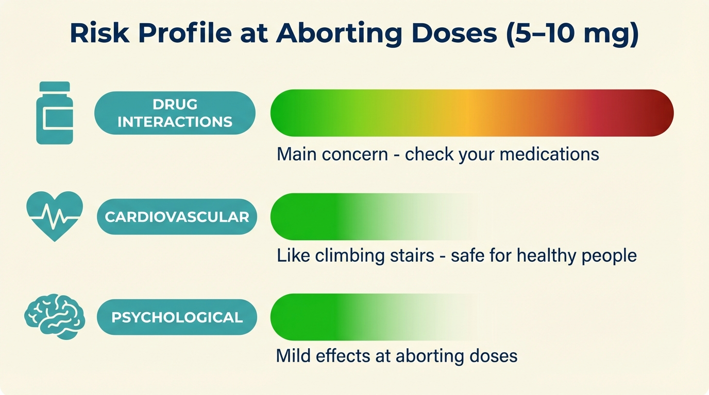
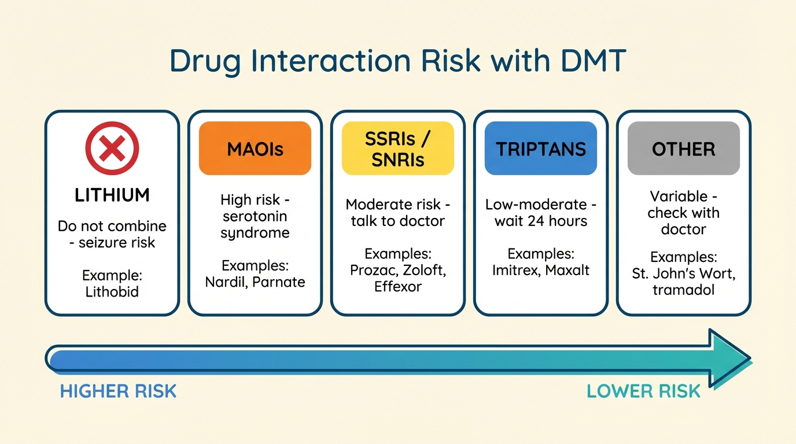
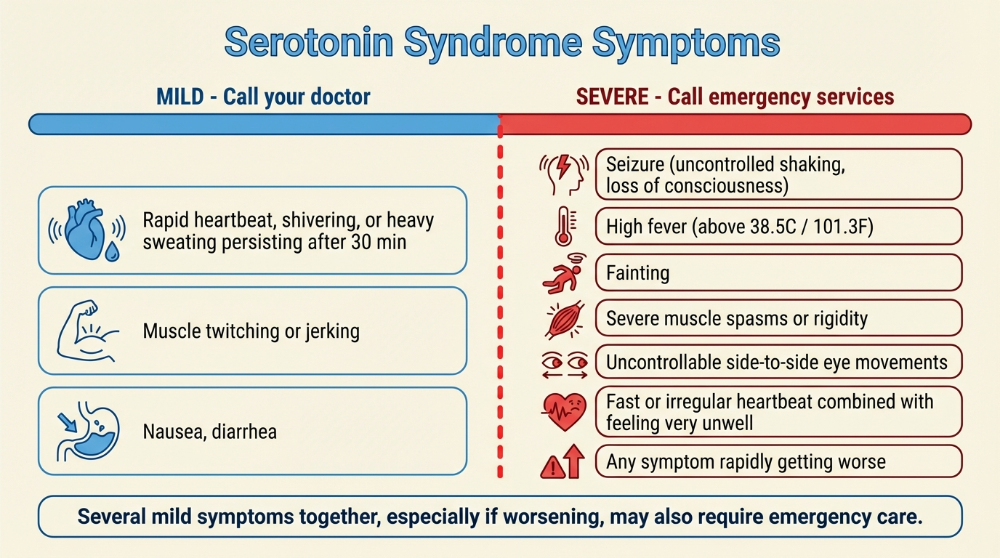

# Safety and Drug Interactions

## How Safe Is DMT?

The [basics page](02-dmt-basics.md) gave you the short version. Here's the fuller picture: at the low doses used to abort cluster headache attacks (5-10 mg), DMT's cardiovascular and psychological risks are very low for healthy people. The main concern, and the reason this page exists, is **drug interactions**, specifically with medications that affect serotonin.

*At aborting doses, the overall safety profile is favorable. Drug interactions are the main concern. [Cardiovascular](#cardiovascular-effects) and [psychological](#psychological-safety) risks are minimal for most people.*

---

**Safety Checklist**

Complete every item on this list before your first use of DMT.

- [ ] **Medications listed.** I have written down all medications, supplements, and herbal remedies I take.
- [ ] **Interactions checked.** I have checked each one against the [drug interactions table](#check-your-medications) below.
- [ ] **Doctor consulted (if needed).** If advised for the medications I take (see table), I have talked to my doctor.
- [ ] **Serotonin syndrome understood.** I understand the [symptoms](#symptoms) and know when to call for help.
- [ ] **Sitter arranged.** I have a [sitter](06-aborting-protocol.md#your-sitter-what-they-need-to-know) for my first few times, and they have also read this page.
- [ ] **Triptan washout (if applicable).** If I take triptans, I will wait at least 24 hours after my last dose before using DMT.

## Drug Interactions at a Glance

DMT acts on the brain's serotonin system. Serotonin is a chemical your brain uses to regulate mood, sleep, and pain. Many common medications also target this system. When two drugs affect serotonin at the same time, their effects can combine in unwanted ways.

Here's the quick summary:

- **Lithium** is a hard stop: **do not take DMT** while on lithium (seizure risk).
- **MAOIs** carry medium-high risk and require a doctor's involvement.
- **SSRIs / SNRIs** need a doctor conversation. The risk is medium-low with a single medication, but it's not zero.
- **Triptans** need a timing gap (at least 24 hours; frovatriptan: 5 days).
- **Everything else:** check with your doctor.

> The danger is not taking DMT while on these medications *per se*. It's doing so **without knowing about serotonin syndrome and what to do if it occurs**. If you take any serotonergic medication, the most important thing is to understand serotonin syndrome ([next section](#serotonin-syndrome-what-you-need-to-know)), know the signs, know what to do, and make sure your [sitter](06-aborting-protocol.md#your-sitter-what-they-need-to-know) knows too.

*Drug interaction risk levels at a glance.*

### Check Your Medications

Before you use DMT for the first time, **make a list of everything you take** (prescriptions, over-the-counter medications, supplements, herbal remedies) and check it against this table.

| Drug / Category | Examples (brand names) | Risk | What to do |
| :--- | :--- | :--- | :--- |
| **Lithium** | Lithobid, Eskalith | **Seizure risk: do not take DMT** | No workaround. DMT is not an option while on lithium. |
| **MAOIs** | Phenelzine (Nardil), tranylcypromine (Parnate), isocarboxazid (Marplan), moclobemide (Manerix); antibiotics: linezolid; plant-based: ayahuasca, Syrian rue, changa | **Medium-high: serotonin syndrome risk** | Must talk to your doctor. Must always have a [sitter](06-aborting-protocol.md#your-sitter-what-they-need-to-know). Read the [serotonin syndrome section](#serotonin-syndrome-what-you-need-to-know) below. |
| **SSRIs / SNRIs** | Fluoxetine (Prozac), sertraline (Zoloft), paroxetine (Paxil), citalopram (Celexa), escitalopram (Lexapro), venlafaxine (Effexor), duloxetine (Cymbalta) | **Medium-low: serotonin effects can stack** | Talk to your doctor. |
| **Triptans** | Sumatriptan (Imitrex), rizatriptan (Maxalt), zolmitriptan (Zomig), frovatriptan (Frova) | **Low serotonin risk, cardiovascular concern** | Wait at least 24 hours after your last triptan dose (frovatriptan: at least 5 days). See [triptans](#triptans) below. |
| **Other serotonergic drugs** (drugs that affect serotonin) | Tricyclic antidepressants (clomipramine, imipramine), opioids (tramadol, fentanyl), dextromethorphan (in many cough medicines), St. John's Wort, amphetamines (Adderall), MDMA / ecstasy | **Variable: depends on the combination** | Talk to your doctor. |

> If your medication isn't on this list, **don't assume it's safe**. Search for your medication name plus "serotonin" online, or ask your doctor or pharmacist.

> **How to talk to your doctor about DMT**
>
> Many doctors have limited knowledge of DMT, and you may worry about being judged. Here's a suggested approach:
>
> 1. **Frame it as harm reduction.** "I have cluster headaches, and I've been reading about people using low-dose DMT to abort attacks. I'd like your help making sure it's safe with my medications."
> 2. **Bring this page.** Show them the [medication table](#check-your-medications) and the [serotonin syndrome section](#serotonin-syndrome-what-you-need-to-know). Doctors respond well to specific, concrete questions.
> 3. **Ask about your specific medications.** "Can you check whether any of my prescriptions interact with a serotonin receptor agonist?"
> 4. **Know that they can't report you.** Doctor-patient conversations are confidential. Your doctor may advise against it, but they cannot report you to law enforcement for asking.

---

## Serotonin Syndrome: What You Need to Know

> **Share this section with your sitter.** If you take any serotonergic medication, make sure the person who stays with you during your first uses has read this section too.

Serotonin syndrome happens when your brain is flooded with too much serotonin. It's most likely when DMT is combined with another drug that also raises serotonin, especially MAOIs, or multiple serotonergic drugs stacking together. It is treatable, and knowing the signs is what makes it manageable rather than dangerous.

The risk increases with higher doses and more serotonergic drugs, but it's hard to predict in advance exactly which combination or dose will trigger it. That's why we recommend talking to your doctor, starting with low doses, and having a sitter.

> **Normal DMT effects vs. serotonin syndrome:** A faster heartbeat, sweating, and dilated pupils are also normal effects of DMT. The key difference is **severity, combination and duration**. A faster heartbeat on its own is expected. But several of these symptoms together, especially if they're severe, or getting worse rather than fading. That's what distinguishes serotonin syndrome from normal DMT effects. When in doubt, call for help.

### Symptoms

**Call emergency services immediately if you experience any of these severe symptoms:**

- Seizure (uncontrolled shaking, loss of consciousness)
- High fever (above 38.5°C / 101.3°F)
- Loss of consciousness or fainting
- Severe muscle spasms, or muscle rigidity (your body feels locked up)
- Uncontrollable side-to-side eye movements
- Fast or irregular heartbeat combined with feeling very unwell
- Any symptom that is rapidly getting worse

**Call your doctor if you experience these milder symptoms:**

- Any of the following normal DMT symptoms persisting after 30 minutes: rapid heartbeat, shivering, heavy sweating
- Muscle twitching or jerking
- Nausea, diarrhea

> **If you're on MAOIs:** Stay with your sitter for at least one hour after taking DMT. MAOIs can delay the onset of serotonin syndrome. You might feel fine at first, then develop symptoms later.

### What to Do

1. **Stop taking DMT** (and any other serotonergic drugs).
2. **Assess severity** using the symptom lists above.
3. **If severe or worsening:** Call emergency services immediately. Tell them you took DMT and list all your medications. Accurate information helps them treat you correctly.
4. **If mild and stable:** Do not take more DMT and have your sitter stay with you until you've been cleared. Call your doctor if you feel unwell.

If you ever need emergency medical help after taking DMT, it's crucial that the medical team knows what you took. **Tell them you took DMT, and list every other medication.** Serotonin syndrome is treatable, but it needs to be correctly identified.

> **Will I get in trouble?** Emergency medical staff are there to help you, not to report you to police. In many jurisdictions, laws protect people who call for help during a drug-related emergency. In any case, **your safety comes first.** Always call for help if you need it.

### Resources

For more detailed information about serotonin syndrome:

- [Demystifying Serotonin Syndrome](https://www.cfp.ca/content/64/10/720) (Canadian Family Physician), which includes a [patient info sheet](https://www.cfp.ca/content/cfp/suppl/2018/10/11/64.10.720.DC1/720_SS_Infographic_Patient.pdf) you can print
- [Serotonin Syndrome](https://my.clevelandclinic.org/health/diseases/17687-serotonin-syndrome) (Cleveland Clinic)
- [Serotonin Syndrome](https://www.mayoclinic.org/diseases-conditions/serotonin-syndrome/symptoms-causes/syc-20354758) (Mayo Clinic)

*Serotonin syndrome symptoms range from mild (left) to severe (right). The red line marks when to call emergency services.*

---

## Drug Interactions in Detail

This section explains each drug category from the [table above](#check-your-medications) in more depth. Read the parts that apply to you.

### Lithium

Lithium is a mood stabilizer prescribed for bipolar disorder and also used as a preventative treatment for cluster headaches. **The combination of lithium and DMT can cause seizures.** This risk is based on reports primarily involving related psychedelics like LSD and psilocybin.

If you take lithium, do not attempt to take DMT.

### MAOIs

MAOIs (monoamine oxidase inhibitors) are medications that slow down the body's ability to break down serotonin. This creates two distinct concerns when combined with DMT:

1. **Serotonin syndrome.** Because MAOIs prevent your body from clearing serotonin normally, serotonin can build up to dangerous levels. Symptoms may develop during or even hours after taking DMT (because the MAOI keeps serotonin elevated for a long time). See the [serotonin syndrome section](#serotonin-syndrome-what-you-need-to-know) above.

2. **Intensified and prolonged trip.** MAOIs make DMT dramatically stronger and longer-lasting. A dose that would normally produce mild effects for 10-20 minutes can instead produce an intense experience lasting 2-4 hours. This can prove psychologically overwhelming.

Common MAOIs include:

- **Prescription antidepressants:** phenelzine (Nardil), tranylcypromine (Parnate), isocarboxazid (Marplan), moclobemide (Manerix)
- **Antibiotics:** linezolid
- **Plant-based:** ayahuasca brews, Syrian rue (harmal), changa blends (which often contain harmine or harmaline)

If you take an MAOI, you must talk to your doctor before attempting DMT. If your doctor gives the go-ahead, always have a sitter who knows the [symptoms of serotonin syndrome](#symptoms), and have them stay with you for at least an hour afterward. Symptoms can be delayed when MAOIs are involved.

### SSRIs and SNRIs

SSRIs and SNRIs are the most commonly prescribed antidepressants. They work by increasing serotonin levels in the brain. When combined with DMT (which also activates serotonin receptors), the effects can stack.

The risk of serotonin syndrome from DMT combined with a single SSRI or SNRI is generally considered **low**, but it is not zero, especially if you're also taking other medications that affect serotonin.

Common SSRIs: citalopram (Celexa), escitalopram (Lexapro), fluoxetine (Prozac), fluvoxamine (Luvox), paroxetine (Paxil), sertraline (Zoloft).

Common SNRIs: venlafaxine (Effexor), duloxetine (Cymbalta), desvenlafaxine (Pristiq).

**Important note about stopping SSRIs:** Some SSRIs remain in your system for weeks after you stop taking them. Fluoxetine (Prozac) is especially long-lasting. If you've recently stopped an SSRI, ask your doctor how long to wait before trying DMT. And **never stop taking antidepressants without medical supervision.** Withdrawal can be serious.

Talk to your doctor before combining DMT with any SSRI or SNRI. Have a sitter for your first few uses, and make sure they're familiar with the [symptoms of serotonin syndrome](#symptoms).

### Triptans

There are two concerns with combining triptans and DMT:

1. **Serotonin syndrome:** Triptans interact with the serotonin system, but [current](https://en.wikipedia.org/wiki/Triptan#Interactions) [evidence](https://www.cfp.ca/content/64/10/720) suggests they are unlikely to contribute meaningfully to serotonin syndrome. Caution is still advised.

2. **Cardiovascular strain:** Triptans narrow blood vessels. DMT raises blood pressure and heart rate. Together, this puts extra stress on the cardiovascular system. This is the bigger concern.

**Recommendation:** Wait at least **24 hours** after your last triptan dose before using DMT. **Exception: frovatriptan (Frova)** has a much longer half-life, so wait at least **5 days**. Some patients eventually use DMT as a replacement for triptans, which avoids the interaction entirely.

### Other Serotonergic Drugs

Many common medications affect serotonin, even if that's not their primary purpose. On their own, most of these have a low interaction risk with DMT. But **multiple serotonergic drugs taken together can stack up** to a significant risk, even if each one alone seems safe.

Drugs in this category include:

- **Tricyclic antidepressants (TCAs):** clomipramine, imipramine
- **Opioid painkillers:** tramadol, methadone, meperidine, fentanyl (note: morphine does *not* have a dangerous serotonin interaction)
- **Cough suppressant:** dextromethorphan (DXM), found in over-the-counter cold and cough medicines
- **Herbal:** St. John's Wort, a common herbal supplement for mood
- **Stimulants:** amphetamine (Adderall, Vyvanse)
- **Recreational drugs:** MDMA / ecstasy
- **Antihistamines:** chlorpheniramine, brompheniramine

> **General advice for everyone:** Make a complete list of everything you take (prescriptions, over-the-counter medications, supplements, herbal remedies). Talk to your doctor. Have a [sitter](06-aborting-protocol.md#your-sitter-what-they-need-to-know) for your first few times.

---

## Cardiovascular Effects

DMT temporarily raises your heart rate and blood pressure. At aborting doses (5-10 mg), this is noticeable, but not dangerous for healthy individuals. Even at much higher doses (50 mg, far more than you'd ever take to abort an attack), this temporary increase is unlikely to pose a significant risk for someone with a healthy cardiovascular system.

> **A simple way to think about it:** If you can climb a flight of stairs without chest pain or shortness of breath, you can very likely handle the cardiovascular effects of DMT at aborting doses.

**Who should be cautious:**

- **High blood pressure or heart conditions.** Talk to your doctor before trying DMT.
- **History of stroke.** Talk to your doctor.
- **Triptan users.** See the [triptans section](#triptans) above for timing and details.

---

## Psychological Safety

At the low doses used for aborting attacks, DMT has mild psychological effects. You will remain aware of where you are, who you're with, and what is happening.

### At Aborting Doses (5-10 mg)

You might feel a warm buzz in your body, see gentle patterns with your eyes closed, or hear a faint hum. You will remain aware and in control. Fear or anxiety is possible but uncommon at these doses, and it **always passes within 10-20 minutes**.

An overwhelming or traumatic experience is very unlikely at aborting doses. The [aborting protocol](06-aborting-protocol.md) is specifically designed to prevent this: you take tiny amounts, one puff at a time, and stop as soon as the headache starts to ease. For a detailed description of what to expect physically, see [what you might feel](06-aborting-protocol.md#what-you-might-feel) on the aborting protocol page.

### At Higher Doses

At 10-25 mg (rarely necessary to abort attacks), you might experience vivid visual patterns even with your eyes open, and a sense of time distortion. Above 25 mg (almost never necessary), the experience can become very intense: the room may seem to disappear, you may feel strong emotions, or even meet "entities": seemingly autonomous beings that feel vividly real.
This is a well-known effect of high-dose DMT, and it passes completely within minutes. These experiences can be positive or negative.

The aborting protocol makes accidentally taking a high dose unlikely. But if it does happen, remember: **the experience will be completely over in 10-20 minutes.**

### Psychosis and Long-Term Effects

The scientific evidence points to a **safe psychological profile** for DMT:

- **In clinical studies with healthy volunteers:** Recent meta-analyses found no cases of severe adverse events (hospitalization, psychosis, or lasting harm), either immediately after taking DMT, or in follow-up.
- **In population studies of ayahuasca users:** Persistent psychotic problems were estimated at roughly 1 in 50,000. Similar rates were found for peyote (a different psychedelic).
- **Dose context:** Clinical safety studies often test doses far higher than the 5-10 mg typically needed to abort attacks.

**Important exception:** If you have a **psychotic disorder** (such as schizophrenia or schizoaffective disorder) or a **close family history** (a parent or sibling) of one, exercise extreme caution. 
People with psychotic disorders are usually excluded from psychedelics clinical trials, so we have very little data on the risks for them. 
Talk to your doctor, and don't take DMT unless you're confident it's safe for you.

---

## Where to Go Next

- **Medications checked, ready to prepare?** Go to [preparing your vape pen](05-preparing-your-dmt-vape-pen.md).
- **Ready to learn the aborting protocol?** Go to [aborting an attack with DMT](06-aborting-protocol.md).
- **Want to review the basics?** Go back to [DMT basics](02-dmt-basics.md).
