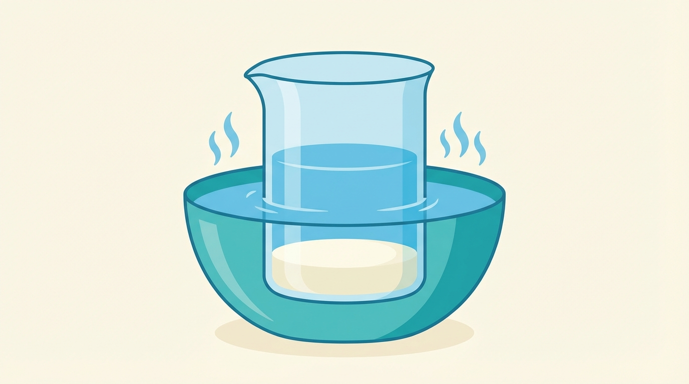
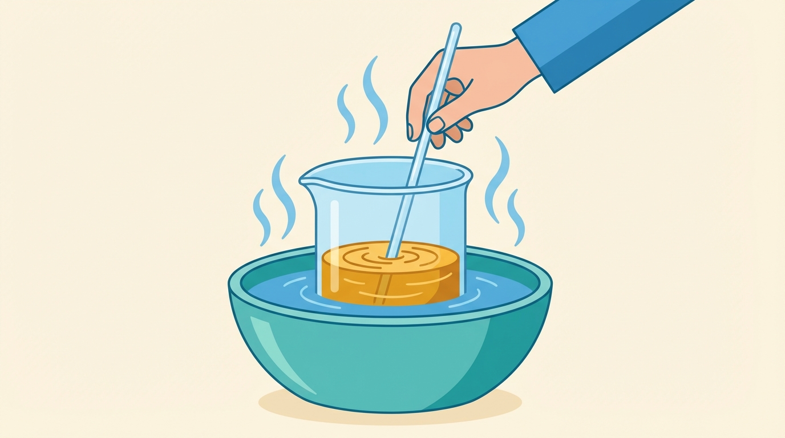

# Preparing Your DMT Vape Pen

Before you can use DMT to abort cluster headache attacks, you'll need a vape pen loaded with DMT liquid. This page walks you through everything, from buying the equipment to having a loaded pen ready to use.

**Time needed:** About 10 minutes of active work, plus 15 minutes of waiting time for the coil to soak.

**If you've never used a vape before, don't worry.** It's simpler than it looks. You're essentially just melting a powder into a liquid and loading it into a small device. If you can cook a dish following a simple recipe, you can do this.

---

## Your options

There are three ways to get a DMT vape pen ready:

- **Option A: Buy a disposable pen or pre-filled cartridge.** These are ready to use out of the box — no mixing required. A disposable pen is a complete device. A pre-filled cartridge screws onto a battery, typically a 510-thread battery (explained below).
  - Disposable pens and pre-filled cartridges are often made for recreational use, so the DMT concentration may be higher than you need for aborting a cluster headache. When in doubt, start with a very small puff and work up (the aborting section explains how).

- **Option B: Battery + cartridge, fill it yourself.** Buy a small pen-style battery and a separate empty cartridge. You mix the DMT liquid yourself (explained below) and fill the cartridge.

- **Option C: Complete kit.** Buy an all-in-one device like the [Coolfire Z60](https://www.innokin.com/coolfire-z60), which comes with a battery, a built-in tank, and a coil: everything except the liquid. You fill the tank yourself. These are bulkier but often have more battery life and an easy-to-read screen.

Your device needs to have **variable voltage**.
This allows you to adjust the temperature to optimally vaporize DMT (see [Aborting Protocol](06-aborting-protocol)).

The rest of this page walks you through Options B and C: mixing the liquid and filling your device. 
If you bought a pre-filled cartridge (Option A), you just need to buy a fitting battery.
Check the vape pen battery section below.

---

## Shopping list

You need seven things. Most can be ordered online and arrive within a few days. Everything except the DMT is standard, legal vaping equipment. You don't need to mention DMT when buying. Vape shops (online or in-person), Amazon, and eBay all carry these items.

*All the items you'll need to buy, at a glance. Details on each one below.*

The instructions below cover Option B in detail; if you're using a complete kit (Option C), the mixing steps are identical — you just fill your kit's tank instead of a cartridge.

### 1. Vape pen battery (~$25-50)

*Skip this if you're buying a complete kit (Option C). It comes with a battery.*

**What it is:** The bottom half of your vape pen: a small rechargeable battery with a button and a charging port.

**What to look for:** You need a battery with **variable voltage.** This means you can turn the temperature up or down with a button or dial. This matters because too low and the liquid doesn't vaporize properly, too high and the DMT gets destroyed by heat. You'll want to start at around **2.5 volts** and adjust upward if needed. Most people find the right setting between **2.5-3.5 volts**. The right setting produces smooth, visible vapor without any burnt taste.

**Some recommended models:**
- [Yocan Uni Pro](https://www.yocan.com/featured_item/uni-pro). Popular, compact, precise voltage control.
- [CCell Fino](https://www.ccell.com/battery/fino). Simple, compact, reliable.

**Make sure the battery is fully charged before you need it.** A dead battery during a cluster attack is the last thing you want. Charge it as soon as it arrives.

### 2. Ceramic coil cartridge (~$5-15)

*Skip this if you're buying a complete kit (Option C). It comes with a tank and coil.*

**What it is:** The top half of your vape pen: a small transparent tank that holds the liquid, with a built-in heating element (called a "coil") at the bottom. Cartridges are frequently sold together with the battery.

**What to look for:**  Get one with a **ceramic** coil. Ceramic heats more evenly than metal, which means the DMT turns into vapor smoothly instead of burning. Look for cartridges labeled "ceramic." 
CCell is a popular brand that uses ceramic, but any ceramic cartridge will work. Make sure it fits your battery: most vape parts use a standard screw-on fitting called "510 thread." When in doubt, ask the shop for a "510 thread ceramic cartridge."

*The parts of a vape pen. The cartridge screws onto the battery via a standard 510 thread connection.*

### 3. Propylene glycol (PG) (~$5-10)

**What it is:** A clear, odorless liquid used as the base to dissolve the DMT into. It's the same liquid used in vape juice and fog machines. 
It is widely available at vape shops and online.

**What to look for:** Get a bottle of **pure PG** (100% propylene glycol), sometimes labeled "PG base" or "PG carrier liquid." 
DMT dissolves well in PG but poorly in vegetable glycerin (VG), so pure PG gives you the most reliable results: no recrystallization, no clogs. 
Vape shops sell PG in small bottles (typically 100-250 ml); you only need a few ml per batch.

> **Can I use PG/VG blend instead?** Yes — a **70/30** or **80/20 PG/VG** blend also works. Here's what you need to now:
> * High PG blends are typically hard to find in stores, so you will likely need to buy PG and VG separately and mix them yourself. If using a ready-made PG/VG blend, make sure it's **nicotine-free** (labeled "0mg").
> * VG makes the smoke smoother but it doesn't dissolve well DMT, so it increases the risk of recrystallization at higher concentrations. 
> * VG increases the vaporization temperature of the DMT liquid (so, you might need to increase your pen voltage to get the same result). 

### 4. DMT powder ($50–$250 per gram)

**What it is:** The active ingredient. DMT in its pure form looks like a white-to-yellowish crystalline powder. You need the **freebase** form, which just means the pure, vaporizable form of the molecule (as opposed to a salt form, which doesn't vaporize efficiently).

### 5. Milligram scale (~$10-20)

**What it is:** A small digital scale that measures in increments of 0.01 grams (that's one hundredth of a gram). You need this to weigh the DMT accurately. Eyeballing it is not safe: too much or too little will affect your dose.

**What to look for:** Any digital scale that reads to 0.01g (sometimes labeled "0.01g precision" or "centigram scale"). They're about the size of a smartphone. Commonly sold as jewelry scales or kitchen precision scales.

### 6. Heat-resistant glass container (~$5-10)

**What it is:** A small glass container to mix the DMT and PG in. You'll place this in a hot water bath, so it needs to handle heat.

**What to look for:** A small glass beaker (100-250 ml), a glass measuring cup, or a small drinking glass all work well. The opening should be wide enough to stir in comfortably. Avoid plastic: glass holds up better to heat and doesn't react with the DMT liquid.

### 7. Syringe (~$1-3)

**What it is:** A small syringe (without a needle) for transferring the finished liquid into your cartridge.

**What to look for:** A 1 ml or 3 ml syringe with a **blunt tip** (no sharp needle). These are sold at pharmacies (ask for an "oral dosing syringe") and online. A blunt-tip syringe makes it easy to fill the narrow cartridge opening without spilling.

### You'll also need (from around the house)

- A **kettle** or way to heat water
- A **bowl, pot or any other container** large enough for the glass container to sit in hot water
- A piece of **paper** (to make a funnel for pouring DMT powder)
- A **glass rod or a metal tool** (for stirring)

---

## Mixing the DMT liquid (step by step)

This is the main preparation step: dissolving DMT powder into PG so it can be vaporized. You'll use a **hot water bath** to melt the DMT, then stir in the PG. The whole mixing process takes about 5-10 minutes.

**The ratio:** We will use **1 gram of DMT per 3 milliliters of PG** (written as 1:3). This gives a concentration of about 333 mg/ml — strong enough to deliver an effective dose in 1-2 puffs, while dissolving reliably without clogging.

> **Other ratios work too.** People use anywhere from 1:1 (very concentrated: stronger per puff, but higher recrystallization risk if using a PG/VG blend) to 1:5 (dilute: more puffs might be needed, but very stable).

> **If you have more or less than 1 gram:** Scale the PG proportionally. For example, 0.5g of DMT needs 1.5 ml of PG. 2g of DMT needs 6 ml. The ratio is always 1 part DMT to 3 parts PG.

### Step 1: Weigh your DMT

Place your glass container on the scale and zero it out (press the "tare" or "T" button so the scale reads 0.00 with the container on it). Then carefully add DMT powder until the scale reads **1.00 g** (1 gram). You can use a piece of paper to funnel the powder into the glass.

*1 gram of DMT powder weighed directly in the glass container. Zeroing the scale with the container on it means the display shows only the weight of the powder.*

### Step 2: Melt the DMT
Prepare hot water for the bath.
The water should be very hot but not boiling, around 50-60 degrees Celsius is ideal.
Think "very hot tap water." 
Pour it into your bowl or container, deep enough that your glass container can sit in it.

Place the glass container (with the DMT already in it) into the hot water bath. 
Within a minute or two, the powder will melt into a clear liquid. 

*The DMT powder melts into a clear liquid in the hot water bath. This usually takes 1-2 minutes.*

### Step 3: Add PG and stir

While the glass container is still sitting in the hot water bath, draw up **3 ml** of PG using your syringe and add it to the melted DMT. (If your syringe doesn't have ml markings, you can measure by weight on your scale instead: 3 grams of PG ≈ 3 ml.)

Stir the mixture with a metal tool (such as a spoon) or glass rod until the liquid is a uniform **clear amber/golden color**.
This usually takes just a minute or two of stirring.

*Stir until the liquid is uniformly clear and amber. No cloudiness, no visible specks.*

If the liquid is cloudy, or if specks visible: stir more, and make sure the water bath is still hot (change the water if needed).

### Step 4: Fill the cartridge

Now use your syringe to transfer the liquid from the glass container into your cartridge.

1. **Screw the cartridge onto the battery** if you haven't already. This gives you something to hold onto.
2. **Unscrew the mouthpiece** from the top of the cartridge. It twists off to reveal the tank opening. You'll see a small hole in the very center: that's the airway (where air flows through when you inhale). **Don't put liquid into that center hole.**
3. **Draw up the liquid** from the glass container with your syringe. Slowly squeeze it into the tank, aiming for the **sides** of the tank (not the center hole). Fill until the liquid is about 1 mm below the top rim. Don't overfill, or it will gurgle and spit when you use it.
4. **Screw the mouthpiece back on.**
5. **Stand the pen upright and wait 15 minutes before using.** This gives the ceramic coil time to soak up (or "wick") the liquid. If you fire the coil while it's still dry, you'll permanently burn it and need a new cartridge.
6. **If you made more liquid than fits in your cartridge**: store the rest in a sealed glass bottle in the freezer (see storage section just below).

---

## Storage and troubleshooting

### Storing DMT powder

If you have DMT powder you're not using right away, store it in its **freebase (powder) form** in a small airtight glass container in the **freezer**. DMT slowly degrades when exposed to air and light (it oxidizes), but keeping it sealed and frozen preserves it for a long time.

### Storing mixed DMT liquid

If you've mixed more liquid than fits in your cartridge, store the extra in a **sealed glass bottle**. A freezer is ideal for long-term storage. If you store the liquid in the freezer, the DMT might crystallize. This is normal and easy to fix. See "If the liquid turns cloudy" below.

### Storing your loaded pen

- Store your loaded pen upright, so the coil stays soaked with liquid
- A bedside drawer or medicine cabinet is fine
- **Keep it out of reach of children and pets.** The loaded pen looks identical to a regular nicotine vape. Consider labeling it clearly (e.g., a piece of tape marked "DMT") so nobody mistakes it for an ordinary vape

### If the liquid turns cloudy or crystallizes

This can happen if the pen or bottle gets cold, and it's completely normal. The DMT has just turned back into tiny solid crystals. **Don't throw it away.**

**To fix it:**
1. Put the cartridge (or bottle) into a small waterproof **zip-lock bag** (to protect it from water)
2. Submerge the bag in a cup of **hot water** for about 5 minutes
3. Take it out and give it a shake
4. The liquid should turn clear again. It's ready to use

### If the cartridge gets clogged

Sometimes DMT re-crystallizes right at the mouthpiece opening, blocking airflow. If you try to inhale and feel resistance:

1. Try gently warming the pen. For example, tug it under your armpit for a couple minutes
2. If that doesn't work, try the hot water bag method above
3. You can also try taking a few short, firm puffs without pressing the button. The suction can loosen it

---

## Quick reference card

*Save a screenshot of this section for quick access.*

### Shopping list
| Item | What to ask for | Approx. cost |
|---|---|---|
| Vape pen battery | "Variable voltage, 510 thread battery" (or complete kit) | $25-50 |
| Cartridge | "510 thread ceramic coil cartridge" (skip if using kit) | $5-15 |
| Propylene glycol (PG) | "Pure PG" or "PG base" | $5-10 |
| DMT powder | Pure freebase powder/crystal form | $50–$250 per gram |
| Digital scale | Reads to 0.01 grams | $10-20 |
| Glass container | Small beaker, Pyrex cup, or glass jar (heat-resistant) | $5-10 |
| Syringe | 1-3 ml, blunt tip preferred | $1-3 |

### Mixing steps (1:3 ratio = 1g DMT per 3ml PG)
1. **Weigh** 1g DMT directly in the glass container (tare the scale first)
2. **Heat** water, pour into a bowl (hot, not boiling)
3. **Place** glass container in hot water bath — DMT melts in 1-2 min
4. **Add** 3ml PG (by syringe or 3g by weight)
5. **Stir** until clear amber, no cloudiness
6. **Fill** cartridge with syringe, avoiding center hole
7. **Wait** 15 min before first use (let coil soak)

### Storage
- **DMT powder:** in airtight glass container, freezer
- **Mixed liquid** (to load pen later): in sealed glass bottle in the freezer
- **Loaded pen:** upright, room temperature
- If liquid crystallizes → warm up under armpit, or zip-lock bag + hot water for 5 min
