# What You'll Need: Preparing Your DMT Vape Pen

Before you can use DMT to abort cluster headache attacks, you'll need to prepare a vape pen loaded with DMT liquid. This page walks you through everything — from buying the equipment to having a loaded pen ready to use.

**Time needed:** About 30 minutes of active work, plus 1 hour of waiting time.

**If you've never used a vape before, don't worry** — it's simpler than it looks. You're essentially just dissolving a powder into a liquid and loading it into a small device. If you can make instant coffee, you can do this.

---

## Shopping list

You need six things. Most can be ordered online and arrive within a few days.

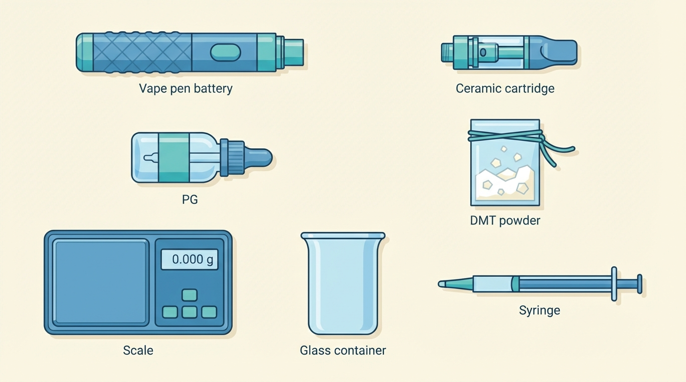
*All six items you'll need to buy, at a glance. Details on each one below.*

### 1. Vape pen battery (~$25–50)

**What it is:** The bottom half of your vape pen — a small rechargeable battery with a button and a charging port. Think of it like the handle of an electric toothbrush.

**What to look for:** You need one with **variable voltage** (sometimes called "variable wattage"). This means you can turn the temperature up or down with a button or dial. This matters because:
- Too low → the liquid doesn't vaporize properly, so you don't inhale enough DMT
- Too high → the DMT molecule gets destroyed by the heat

**Recommended models:**
- [CCell Fino](https://www.ccell.com/battery/fino) — simple, compact, reliable
- [Coolfire Z60](https://www.innokin.com/coolfire-z60) — more battery life, easy-to-read screen

**Where to buy:** Any vape shop (online or in-person). These are standard, legal items — you don't need to mention DMT when buying.

### 2. Ceramic coil cartridge (~$5–15)

**What it is:** The top half of your vape pen — a small transparent tank that holds the liquid, with a built-in heating element (called a "coil") at the bottom.

**What to look for:** Get one with a **ceramic** coil. Ceramic heats more evenly than metal, which means the DMT turns into vapor (a fine mist you inhale) smoothly instead of burning. Look for cartridges labeled "ceramic" — CCELL is a popular brand that uses ceramic, but any ceramic cartridge will work. Make sure it fits your battery: most vape parts use a standard screw-on fitting called "510 thread" (like how most garden hoses use the same connector). When in doubt, ask the shop for a "510 thread ceramic cartridge."

**Where to buy:** Same vape shop as the battery. Often sold together.

### 3. Nicotine-free vape juice (~$5–10)

**What it is:** A flavored liquid that you'll use as a base to dissolve the DMT into. It's the same liquid that regular vapers use, but **without nicotine** (you don't want nicotine — the label should say "0mg," meaning zero milligrams of nicotine).

**What to look for:** Vape juice is made from two ingredients — propylene glycol (PG) and vegetable glycerin (VG). Both are common, food-safe substances. Get a bottle labeled **50/50** (meaning half of each). This ratio dissolves DMT well and produces smooth vapor. The flavor doesn't matter much — pick whatever you like or a simple flavor.

> **Example:** The photos in this guide use "Mad King Vimtoz" 50VG/50PG, 0mg nicotine — but any 50/50 nicotine-free vape juice will work.

**Where to buy:** Any vape shop or online vape retailer.

### 4. DMT powder (~varies)

**What it is:** The active ingredient. DMT in its pure form looks like a white-to-yellowish crystalline powder. You may hear it called "freebase DMT" — "freebase" just means it's the pure, smokable form of the molecule (as opposed to a salt form, which can't be vaporized). The powder may range from white to deep yellow/amber depending on the extraction method — all of these are fine.

**Where to get it:** This guide does not cover sourcing. If you have access to DMT, it should be in powder/crystal form for this method to work.

### 5. Milligram scale (~$10–20)

**What it is:** A small digital scale that measures in increments of 0.01 grams (that's one hundredth of a gram). You need this to weigh the DMT accurately. Eyeballing it is not safe — too much or too little will affect your dose.

**What to look for:** Any digital scale that reads to 0.01g (sometimes labeled "0.01g precision" or "centigram scale"). They're about the size of a smartphone.

**Where to buy:** Amazon, eBay, or kitchen supply stores. They're commonly sold as jewelry scales or kitchen precision scales.

### 6. Small mixing bottle (~$1–5)

**What it is:** A small empty bottle (about 10 ml) to mix the DMT and vape juice in. A small glass bottle with a dropper (a squeeze-top that lets you dispense liquid drop by drop) works well. You can also use a small empty vape juice bottle.

**What to look for:** It should be sealable (screw cap or dropper top) and heat-resistant. Glass is ideal. The bottle in our photos is a 10 ml plastic dropper bottle, which also works fine.

**Where to buy:** Amazon, pharmacies, or craft supply stores. Search for "10ml dropper bottle."

### You'll also need (from around the house)

- A **kettle** or way to heat water (not boiling — just very hot)
- A **mug** or small bowl to hold the hot water
- **Clear tape** or cling film (to waterproof the bottle)
- A piece of **aluminum foil** (for weighing)
- A piece of **paper** rolled into a funnel (for pouring powder)

---

## Understanding your vape pen

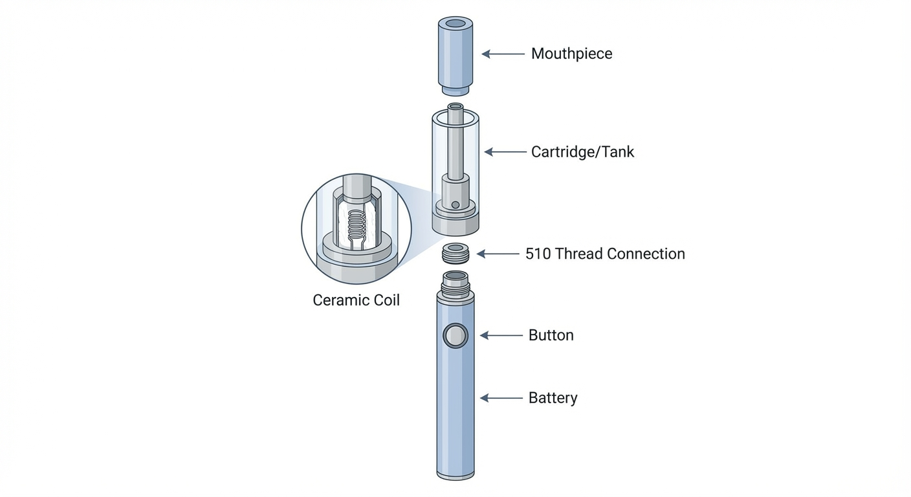
*A vape pen taken apart to show its pieces. In practice, the cartridge screws onto the battery and the mouthpiece sits on top — you only handle it as one assembled unit.*

A vape pen has two parts that screw together:

1. **Battery** (the bottom part) — powers the device. Has a button to activate it and a way to adjust the voltage/temperature.
2. **Cartridge** (the top part) — holds the liquid. Inside it is a small ceramic coil that heats up when you press the button, turning the liquid into vapor that you inhale through the mouthpiece (the tip at the very top that you put your lips on).

**That's it.** You press the button, the coil heats the liquid, you breathe in the vapor. The same principle as a kettle turning water into steam — just smaller.

### What "variable voltage" means

The voltage setting controls how hot the coil gets. Your device will show a number on its screen or near a dial — that's your voltage. You'll want to start at a **low setting** (around **2.5 volts**) and adjust upward if needed — most people find the right setting between **2.5–3.5 volts**. The right setting produces a smooth, visible vapor without any burnt taste. If you taste burning, turn it down.

---

## Mixing the vape juice (step by step)

This is the main preparation step: dissolving DMT powder into vape juice so it can be vaporized. We're using the **bottle method** — you mix everything in a small bottle using hot water to help the powder dissolve.

**The ratio:** We use **1 gram of DMT per 1 milliliter of vape juice** (written as 1:1). This is the standard starting concentration.

### Step 1: Weigh your DMT

Place a piece of aluminum foil on your scale and zero it out (press the "tare" or "T" button so the scale reads 0.00 with the foil on it). Then carefully add DMT powder until the scale reads **1.00 g** (1 gram).

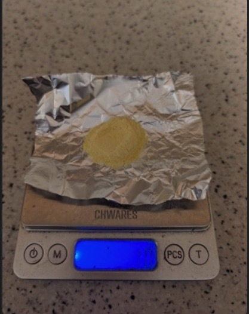
*1 gram of DMT powder on a CHWARES digital scale. The aluminum foil makes it easy to pour the powder afterward.*

### Step 2: Measure vape juice into the mixing bottle

Pour **1 ml** (1 milliliter) of your nicotine-free vape juice into the small mixing bottle. If your vape juice bottle has measurement markings, use those. Otherwise, 1 ml is about 20 drops from a standard dropper.

> **Note about the photos:** Don't worry that the photos show more liquid than 1 ml — the person who took these was making a larger batch (5g of DMT in 5 ml of juice). The ratio is the same (1:1). For your first time, 1g in 1 ml is plenty and will fill several cartridges.

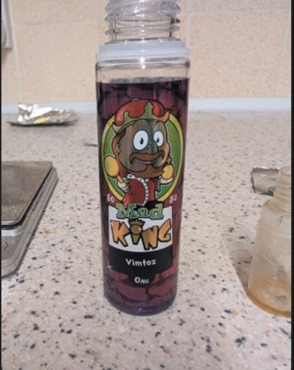
*Nicotine-free (0mg) vape juice with a 50/50 PG/VG ratio. Any brand with these specs works.*

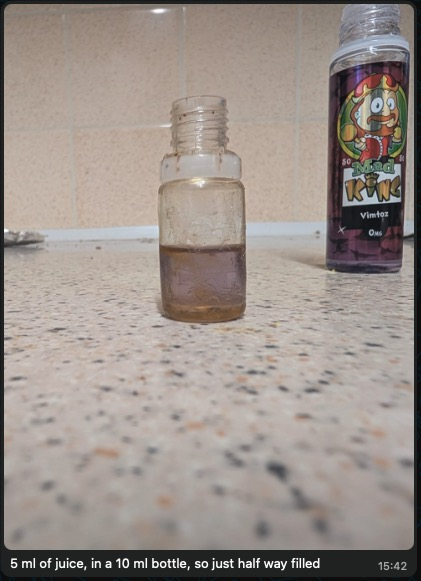
*Vape juice measured into a 10 ml mixing bottle. The large bottle in the background is just the source — you mix in the small one.*

### Step 3: Add the DMT powder to the bottle

Roll a small piece of paper into a cone/funnel shape and use it to carefully pour the DMT powder from the foil into the mixing bottle. Go slowly — the powder is fine and you don't want to spill any.

> **Handling tip:** Work in a calm spot without drafts — the powder is light and can become airborne. If you get any on your hands, wash them with soap and water. It won't harm you in small amounts, but you want the DMT in the bottle, not on your skin.

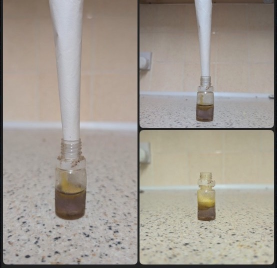
*A rolled piece of paper makes a simple funnel. Tilt the foil gently to slide the powder in.*

**What to expect:** The powder will sit on top of the liquid or sink to the bottom. It will NOT dissolve on its own — that's what the next steps are for.

### Step 4: Seal the bottle and shake for 1 minute

Screw the cap on tightly. Shake the bottle vigorously for about 1 minute.

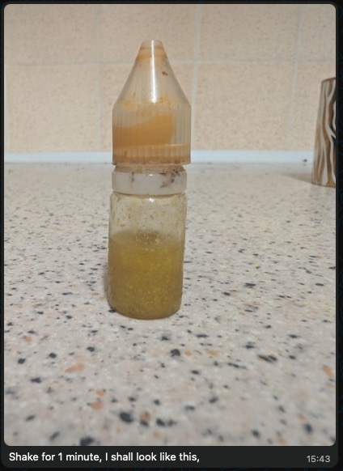
*After shaking for 1 minute, the mixture will look cloudy and murky like this. That's normal — it hasn't dissolved yet.*

**What to look for:** The liquid should be uniformly cloudy. If you see dry powder stuck to the sides, shake harder or tap the bottle to knock it loose.

### Step 5: Waterproof the bottle, then hot water bath

**First**, wrap the bottle (especially the cap/top) with clear tape or cling film. This is critical — if water gets into the mixture, it's ruined.

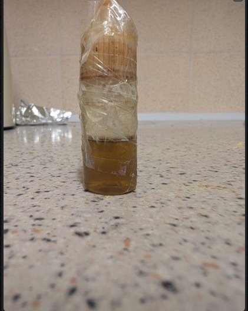
*Wrap the cap and top of the bottle in tape so that no water can seep in during the hot water bath.*

**Then**, boil your kettle and pour the hot water into a mug. Place the sealed, taped bottle into the mug of hot water. Let it sit for **10–15 minutes**.

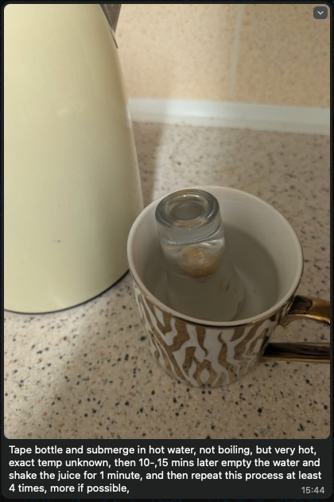
*The bottle sits in hot (not boiling) water in a mug. The heat helps the DMT dissolve into the liquid. Make sure the water level doesn't go above the taped seal.*

> **Important:** Use very hot water from a recently boiled kettle — but don't put the bottle directly into boiling water on the stove. Pour the hot water into a mug first.

> **Careful with the hot water.** When removing the bottle from the mug, it will be very hot. Let it cool for 30 seconds before shaking, or use a towel or oven mitt to grip it.

### Step 6: Remove, shake, and repeat

After 10–15 minutes, take the bottle out of the water. **Shake it vigorously for 1 minute** again. Then:

1. Empty the mug and refill with fresh hot water
2. Put the bottle back in
3. Wait another 10–15 minutes
4. Take it out and shake again

**Repeat this cycle 3–4 times total.** Each round dissolves more of the DMT. You'll see the liquid getting clearer with each cycle.

### Step 7: Check your result

After 3–4 hot water cycles, the mixture should be a **clear amber/golden liquid** — ranging from pale gold (like apple juice) to deeper amber (like honey). Hold it up to a light:

- **Clear amber = good to go.** The DMT has fully dissolved.
- **Cloudy, murky, or specks visible = not ready.** Do another hot water cycle and shake.

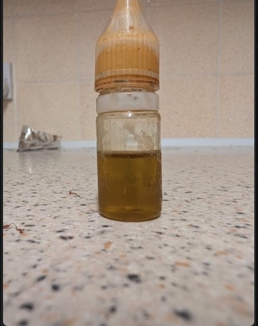
*Finished: a clear, amber-colored liquid. No cloudiness, no visible specks or crystals. This is ready to load into your cartridge.*

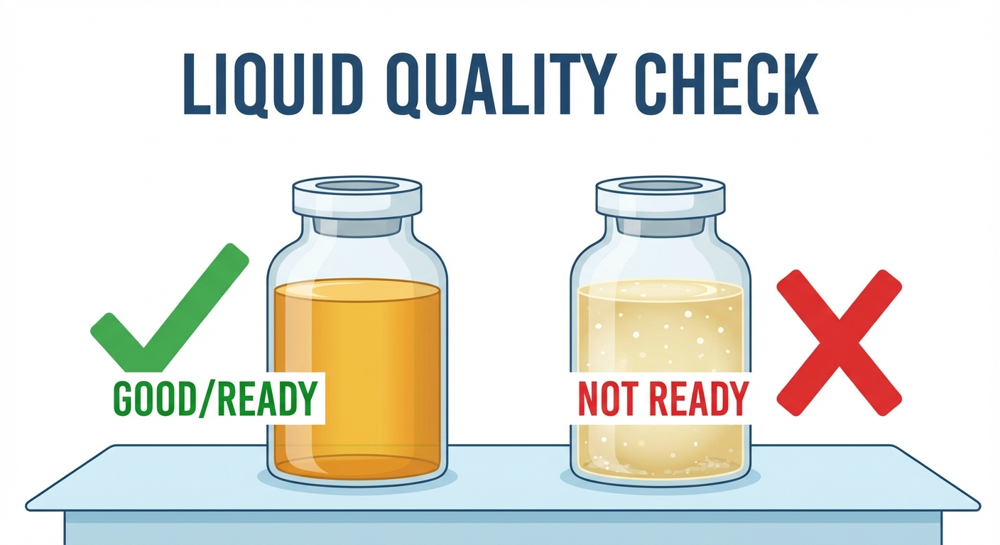
*Hold your bottle up to a light. Left: clear and amber means it's ready. Right: cloudy with visible particles means you need another hot water cycle.*

> **Why clarity matters:** Any undissolved DMT crystals will clog the tiny holes in your cartridge's coil. A clogged cartridge won't produce vapor — which means it won't work when you need it during an attack.

---

## Filling the cartridge

Now you need to get the liquid from the mixing bottle into the cartridge.

1. **Screw the cartridge onto the battery** if you haven't already — this gives you something to hold onto.
2. **Unscrew the mouthpiece** from the top of the cartridge. It twists off to reveal the tank opening. You'll see a small hole in the very center — that's the airway (where air flows through when you inhale). **Don't put liquid into that center hole.**
3. **Squeeze or drip the liquid** from your mixing bottle into the tank, aiming for the **sides** of the tank (not the center). Go slowly. Fill until the liquid is about 1 mm below the top rim — don't overfill, or it will gurgle and spit when you use it.
4. **Screw the mouthpiece back on.**
5. **Stand the pen upright and wait 15-30 minutes before using.** This gives the coil time to soak up the liquid.

> **Why wait?** Inside the cartridge, the ceramic coil needs time to soak up (or "wick") the liquid — like a sponge absorbing water. If you press the button while the coil is still dry, you'll permanently burn it. The cartridge will taste like burnt rubber from that point on and you'll need a new one. An hour of patience saves you a cartridge.

---

## Storage and troubleshooting

### Storing your pen

- Store your loaded pen upright, to make sure the coil stays soaked with liquid
- Avoid cold environments — a cold car, basement, or garage can cause the DMT to turn back into crystals inside the liquid
- A bedside drawer or medicine cabinet is fine
- **Keep it out of reach of children and pets.** The loaded pen looks identical to a regular nicotine vape. Consider labeling it clearly (e.g., a piece of tape marked "DMT") so nobody mistakes it for an ordinary vape
- The mixed liquid stays good for **several months** at room temperature. If you notice a significant change in color or smell, make a fresh batch

### If the liquid turns cloudy or crystallizes

This can happen if the pen gets cold, and it's completely normal. The DMT has just turned back into tiny solid crystals. **Don't throw it away.**

**To fix it:**
1. Put the cartridge into a small waterproof **zip-lock bag** (to protect it from water)
2. Submerge the bag in a cup of **hot water** for about 5 minutes
3. Take it out and give it a gentle shake
4. The liquid should turn clear again — it's ready to use

### If the cartridge gets clogged

Sometimes DMT re-crystallizes right at the mouthpiece opening, blocking airflow. If you try to inhale and feel resistance:

1. Try the hot water bag method above — heat often clears the clog
2. If that doesn't work, gently poke a **toothpick** or thin pin into the mouthpiece opening to clear the blockage
3. You can also try taking a few short, firm puffs without pressing the button — the suction can loosen it

### If you taste burning

Turn the voltage **down**. A burnt taste means the temperature is too high and the DMT is being destroyed rather than vaporized. You want smooth, clean-tasting vapor.

---

## Quick reference card

*Save a screenshot of this section for quick access.*

### Shopping list
| Item | What to ask for | Approx. cost |
|---|---|---|
| Vape pen battery | "Variable voltage, 510 thread battery" | $25–50 |
| Cartridge | "510 thread ceramic coil cartridge" | $5–15 |
| Vape juice | "50/50 nicotine-free vape juice" | $5–10 |
| DMT powder | Pure powder/crystal form | Varies |
| Digital scale | Reads to 0.01 grams | $10–20 |
| Small mixing bottle | 10 ml, sealable | $1–5 |

### Mixing steps (1:1 ratio = 1g DMT per 1ml juice)
1. **Weigh** 1g DMT on scale
2. **Measure** 1ml vape juice into small bottle
3. **Add** DMT powder to bottle (paper funnel helps)
4. **Seal and shake** vigorously for 1 minute
5. **Tape** bottle, place in mug of hot water for 10–15 min
6. **Remove and shake** 1 minute — repeat hot water cycle 3–4 times total
7. **Check:** should be clear amber, no cloudiness
8. **Fill** cartridge, avoiding center tube
9. **Wait** 30–60 min before first use (let coil soak)

### Storage
- Upright, room temperature
- If it crystallizes → zip-lock bag + hot water for 5 min
