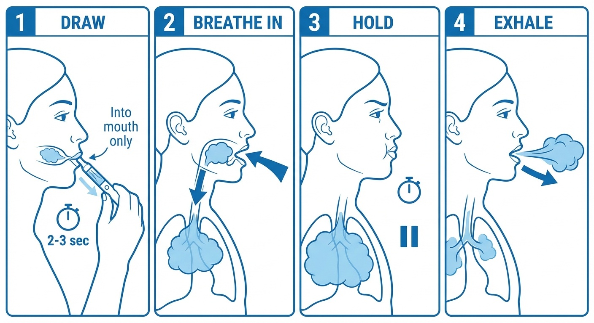
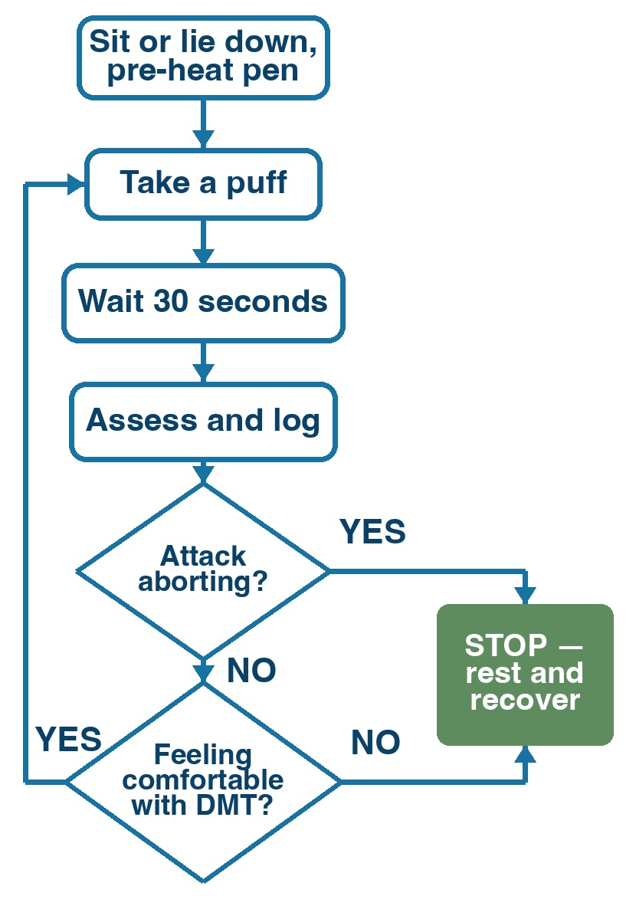
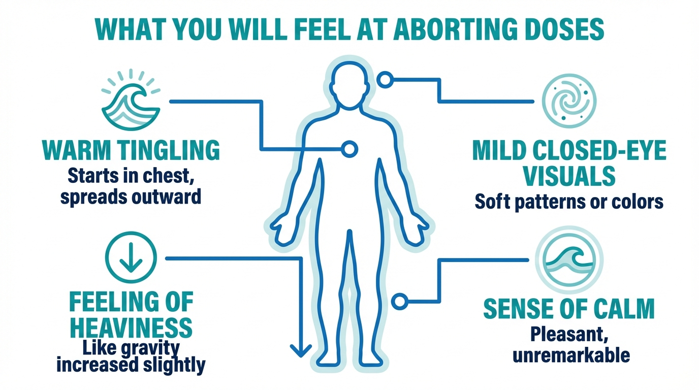
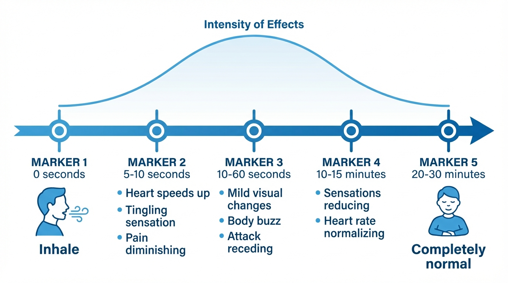
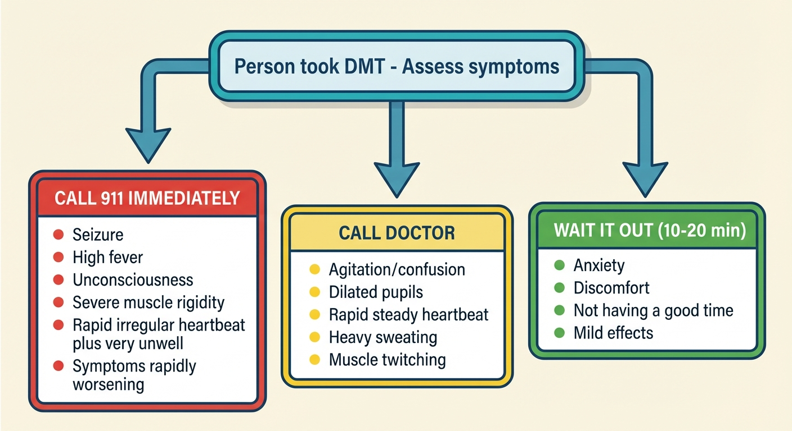

# Aborting an Attack with DMT

This page covers how to use your DMT vape pen to stop a cluster headache attack, and how to practice beforehand so you feel confident when an attack hits.

**Time needed:** The abort itself takes 1-5 minutes. You may feel mild effects for up to 20 minutes afterward.

**If you've never taken DMT or similar substances before, that's completely fine.** The doses used here are small, much less than what recreational users typically take. 
This page will walk you through exactly what to do, step by step.

---

## Before your first time: safety checklist

Before you ever press the button on your pen, make sure you've completed every item on this list.

- [ ] **Drug interactions checked.** If you take any medication, supplement, or herbal remedy, you've read the [safety page](03-safety.md#check-your-medications) and confirmed it's safe to combine with DMT. **If you take lithium: do not take DMT.**
- [ ] **Heart health considered.** DMT temporarily raises your heart rate and blood pressure, similar to climbing a flight of stairs quickly. If you have high blood pressure, a heart condition, or a history of stroke, talk to your doctor before trying DMT. Triptans (sumatriptan, rizatriptan, etc.) narrow your blood vessels, putting additional strain on your heart. We recommend waiting at least 24 hours after your last triptan dose before taking DMT.
- [ ] **Sitter present for your first time.** Your very first use of DMT must be a practice session (not during an attack), with a sober person present. After you've practiced successfully, a sitter is recommended but not required for subsequent uses. See the [sitter section](#your-sitter-what-they-need-to-know) below.
- [ ] **Vape pen loaded, charged, and tested.** You've followed the [preparation page](05-preparing-your-dmt-vape-pen.md).
- [ ] **Comfortable, familiar space.** You're somewhere you feel safe: your bedroom, living room, or another private, quiet place. Not in public, not driving, not operating machinery.
- [ ] **Phone accessible.** In case of emergency, your phone (or your sitter's phone) should be within arm's reach.

---

## How to inhale (for people who have never vaped)

This is the most important technique to learn. It's not hard, but it's different from just breathing normally.

*Four steps: (1) Draw vapor into your mouth for 2-3 seconds, (2) Remove pen and breathe fresh air deep into your lungs, (3) Hold for 10+ seconds, (4) Exhale slowly.*

### Step by step:

1. **Hold the pen to your lips** like a straw. Press and hold the button.
2. **Draw gently for 2-3 seconds.** Suck the vapor into your *mouth*. Don't try to breathe it straight into your lungs yet. Think of it like sipping a thick milkshake through a straw: slow, steady, gentle. You should feel warm vapor filling your mouth.
3. **Remove the pen from your lips.** Now breathe in deeply through your mouth. This pulls the vapor from your mouth down into your lungs, along with fresh air. Your lungs should feel full.
4. **Hold your breath for 10 seconds or more.** You don't need to count precisely. Hold for as long as you can confortably.
5. **Exhale slowly** through your mouth. You should see a visible cloud of vapor. If you see nothing, you may not have drawn enough; try a slightly longer draw next time.

> **What you should taste:** A mildly chemical or plastic-like taste is normal. If you taste something harsh or burnt, your temperature is too high. Turn it down. The vapor should feel smooth, not irritating.

> **If it makes you cough:** That's common the first time. Try a shorter, gentler draw (1-2 seconds instead of 3). You'll get used to it quickly.

---

## Your first time: the practice session

**We do not recommend using DMT for the first time during an attack.** Instead, practice when you're calm and pain-free.

### Practice session steps

Pick a time when you're feeling relaxed: an evening at home, a weekend afternoon. Have your sitter with you.

1. **Sit down somewhere comfortable.** A couch or recliner is ideal. Have a glass of water nearby.
2. **Tell your sitter you're starting.** They should be in the same room, relaxed. If you want, you can ask your sitter to record their observations, as this might help you document the protocol you followed.
3. **Set your vape pen to a low voltage:** start at **2.5V**. If your device shows temperature instead of voltage, start around 200°C (392°F).
4. **Take one puff** using the inhaling technique described above.
5. **Wait 30 seconds.** Pay attention to how your body feels. You might notice a warm or tingling sensation ("body buzz"), or you might feel nothing at all.
6. **If you felt nothing**, turn the voltage up slightly (to about **3.0V** / 210°C) and try one more puff. Wait another 30 seconds.
7. **If you felt a gentle warmth or tingling**, that's the DMT. Sit with it for a few minutes. Notice how it feels. It will fade within 10-20 minutes.
8. **Talk to your sitter** about what you noticed. They should note what settings you used and how it felt. This information will help during a real attack.

> **Don't chase a big effect.** The goal of the practice session is just to feel a mild buzz. One or two small puffs is enough.

---

## The aborting protocol

As soon as you feel an attack coming on, this is what to do. The entire process takes just a few minutes.

The key idea is simple: **take a small dose, wait, and see if the pain is gone. If not, take another. You do not need to take a large dose all at once.** Small puffs that you add one at a time let you use only as much DMT as you need.

At first, you might need a couple puffs to abort your attack. Over time, you will find the best settings (vape voltage, how deep you inhale, etc.) to abort as quickly as possible without unnecessarily tripping.

**You can use this protocol for every attack,** including multiple attacks in the same day. Unless you take MAOIs, DMT leaves your body within minutes, so there is no buildup from repeated use.

> **Can I accidentally have an intense trip?** At these low doses, it's very unlikely. DMT acts within seconds, so you'll feel the effects of each puff before you take the next one. The aborting protocol gives you full control: you stop as soon as you feel the DMT working, well before anything intense could happen.

### Step 1: Prepare

- **Sit or lie down.**
- **Grab your pen.** Make sure it's on and set to the voltage that worked during your practice session (typically **2.5-3.5V**). If the pen doesn't produce vapor, it may be clogged. Warm it under your armpit for a minute and try again. 
- **Tell your sitter** (if present): "I'm going to use the pen now." Optionally tell them to log their observations too.

### Step 2: Take a puff

Inhale using the technique you practiced:
- Press the button, draw gently for 2-3 seconds
- Remove pen, breathe in deeply
- Hold for 10+ seconds
- Exhale

### Step 3: Wait 30 seconds

Put the pen down. Breathe normally. DMT acts fast. If it's going to work, you'll start to feel something within seconds.

### Step 4: Assess

- **Has the pain stopped?** When DMT aborts an attack, the pain typically vanishes sharply.
- **Do I feel the DMT acting?** You might feel a "body buzz": a warm, tingling sensation, especially in your chest or limbs. Some users report feeling the body buzz at about the dose they take to abort their attacks. 
    - Other common effects include feeling your heart racing, feeling cold, seeing visual patterns (especially with eyes closed), or a sense of bodily compression or pressure.

### Step 5: Repeat if needed

- **If the pain is not gone after 30 seconds**, take another puff. Same technique. Wait another 30 seconds and assess again. Repeat this cycle until the pain stops, **or** if you feel the effects are about to get too intense for you.

### Step 6: Document everything

When you feel ready, take a moment to log the protocol you followed and the effects you felt.

*Visual summary: puff, wait 30 seconds, assess. If the pain persists, take another puff if you feel comfortable with it.*

---

## What you might feel

This section describes what most people experience at the low doses used for aborting attacks. **Every person is different;** you may feel all, some, or none of these.

<!-- 
*The most common sensations at aborting doses.* -->

*Approximate timeline of effects after inhaling DMT. Pain relief is typically sharp and sudden (within seconds), while the mild DMT side effects (body buzz, visual changes) fade gradually over 20-30 minutes.*

### In the first 10 seconds
- A **warm, tingling sensation** spreading through your body: the "body buzz." It often starts in the chest and moves outward.
- A feeling of **heaviness**, like gravity just increased. Your arms and legs may feel heavier than usual.
- Your **heart may beat faster.** This is normal and not dangerous. It's similar to climbing a flight of stairs quickly.

### Over the next 1-5 minutes
- Mild **visual changes** (especially with your eyes closed): patterns, colors, or geometric shapes. If you've never experienced altered perception before, this can feel strange, but it's a completely normal effect of the substance, not a sign that anything is wrong with your brain. It will stop on its own.
- You might feel **cold** or notice slight **sweating**.
- A feeling of **calm** or mild **euphoria,** which many people describe as pleasant.
- Less commonly: mild **dizziness**, slight **nausea**, or a **high-pitched ringing** sound.

### At 5-30 minutes
- Effects gradually fade. The body buzz reduces, your heartbeat returns to normal.
- Any visual effects stop.
- By 20-30 minutes, you should feel **back to normal**, with no, or barely any lingering effects.

> **How do you know it worked?** If the DMT successfully aborts your attack, the pain will drop away sharply, often within seconds. This is not a gradual fade; when the dose is sufficient, the relief is unmistakable.

---

## If you have a bad experience

It's possible, especially if you accidentally take a larger dose, that you feel anxious, scared, or overwhelmed. This is uncommon at the small doses used for aborting attacks, but it can happen, and it's important to be prepared.

**The single most important thing to remember:**

> **"This is a normal effect of the drug, and I accept the experience. It will be completely over in 10-20 minutes."**

### What to do

1. **Focus on your body.** Feel the weight of your body on the chair or bed. Press your feet into the floor.
2. **Breathe slowly.** In for 4 counts, out for 4 counts. Focus on the counting. 
3. **Don't resist, accept the experience.** This is counterintuitive, but trying to push the experience away often makes it worse. Instead, let the sensations be there. You don't have to enjoy them; just let them pass, like waves. They will pass.
4. **Talk to your sitter.** Saying "I feel anxious" or "I don't like this" out loud can be surprisingly helpful. Your sitter can remind you that you're safe and that it will end soon.

If your sitter is with you, they should follow the guidance in the [sitter section](#your-sitter-what-they-need-to-know) below. 
The key points for the sitter are: stay calm, speak in a low steady voice, don't touch without asking, and give gentle time updates.

---

## After the attack

### Recovery time

- **Do not drive** for at least 30 minutes after your last puff, preferably longer if you took multiple puffs or felt significant effects.
- **Drink some water.** Some people feel mildly dehydrated afterward.

### Logging

After you've recovered, take a few minutes to write down:
- **What settings** you used (voltage or temperature)
- **How many puffs** you took
- **How quickly** the pain responded (seconds? minutes? not at all?)
- **What you felt** (body buzz, visuals, anxiety, nothing?)
- **Anything else** you'd do differently next time

This log is invaluable. Over time, you'll dial in the exact settings that work for your attacks.

---

## Quick reference card

*Save a screenshot of this section, or print it and keep it with your pen.*

### Aborting protocol
1. **Sit or lie down.** Tell your sitter (or text someone).
2. **Set pen** to your usual voltage (typically **2.5-3.5V**).
3. **Puff:** Draw 2-3 sec → breathe in deep → hold 10+ sec → exhale.
4. **Wait 30 seconds.** Is pain reducing? Do you feel a body buzz?
5. **If no effect → take another puff.** Wait 30 sec, assess again.

### Signs it's working
- Pain drops away sharply
- Warm tingling ("body buzz") in chest/limbs

### If things feel wrong
- Put the pen down
- Breathe: in for 4, out for 4
- Remember: **over in 10-20 minutes**
- Sitter: stay calm, provide grounding if needed, don't over-interact.

### Pen not working?
- No vapor: check it's turned on, try a higher voltage setting
- Clogged: warm the pen under your armpit for a minute

### Sitter: call emergency services if
- Seizure
- High fever
- Loss of consciousness
- Rapid irregular heartbeat + very unwell
- Symptoms rapidly worsening

---

## Your sitter: what they need to know

A sitter is a sober person who stays with you while you use DMT. For your very first time (the practice session), a sitter is required. 
After that, a sitter is recommended but not strictly necessary, unless you're on MAOIs (see the [safety](03-safety.md) section). 
See [If you're on your own](#if-youre-on-your-own) below.

### Give this page to your sitter

The information below is written directly to the sitter.

---

**To the sitter:** Someone you care about is using a small amount of DMT to try to stop a severe headache attack. Your job is simple and important: be present, stay calm, and know when to get help.

### What will happen

The person will inhale vapor from a small pen (like an e-cigarette). The DMT takes effect within seconds. At the low doses used here, they will likely:

- Seem quiet or still for a few minutes
- Report feeling warm or tingly
- Maybe close their eyes
- Possibly look slightly flushed

The effects wear off within 10-20 minutes. They should be completely back to normal within 30 minutes.

### Your responsibilities

1. **Be in the room** while they use the pen. You don't need to hover; just be nearby.
2. **Keep track.** Note when they take each puff, and how they do it. This might be useful later to log the protocol.
3. **Stay calm no matter what.** If they seem anxious or say they're scared, your calm presence is the most important thing. Say: "You're safe. This is temporary. I'm right here."
4. **Don't leave the room** until they tell you they feel normal again.

### If they have a bad experience

- **Stay calm and present.** Don't panic. Your calm demeanor is their anchor.
- **Speak in a low, steady voice.** "You're safe. This is normal. It'll be over in a few minutes."
- **Don't touch them without asking.** Some people find touch comforting; others find it overwhelming.
- **Don't try to talk them out of it** or reason with them. Just be there.
- **Keep track of time** and give gentle updates: "It's been 5 minutes. You're doing great. About 10 more minutes."

### What NOT to do

- **Don't take DMT yourself** during this time. You need to be sober and clearheaded.
- **Don't shake them, shout, or try to "snap them out of it."** The experience passes on its own.
- **Don't play loud music or turn on bright lights.** Keep the environment calm.

### When to call for help

**Call emergency services (911 / 112 / 999) if:**

- They have a **seizure** (uncontrolled shaking, loss of consciousness)
- They have a **high fever** (hot to the touch, sweating profusely, confused)
- They **pass out** and you cannot wake them
- They have a **rapid, irregular heartbeat** combined with looking very unwell
- Any symptom is **rapidly getting worse**

These emergency situations are **extremely rare** at the doses used in this guide, but they are more likely if DMT is combined with certain medications (especially lithium or MAOIs). Make sure you've both checked the [safety page](03-safety.md#check-your-medications).

<!-- 
*Quick reference for sitters: how to assess symptoms and decide what to do.*
 -->
If they have taken MAOIs **stay with them for at least one hour** after they took DMT. MAOIs prolong the effect of DMT, and can delay the onset of serotonin syndrome.

> **What to tell the dispatcher:** Be honest: tell them the person inhaled DMT and describe the symptoms. Medical professionals need accurate information to treat correctly. Their job is to help, not to judge.

**For non-emergencies** (they feel anxious, they don't like the sensation, they feel nauseous): stay with them, reassure them, and wait. It will pass within 10-20 minutes.

---

## If you're on your own

The reality of cluster headaches is that attacks often strike at 2 or 3 in the morning, when your sitter is asleep or unavailable. A sitter is required for your first time (the practice session) and recommended for the first several attacks afterward, but once you're comfortable with the technique, aborting solo is reasonable.

A few extra precautions:

- **Text someone before you start.** A quick "Using my pen now, will check in shortly" to a partner, friend, or family member. This way, someone knows.
- **Keep your phone within arm's reach.** Unlocked, with the emergency number visible.
- **Stay seated or lying down.** This matters even more without a sitter. If you feel dizzy, you don't want to be standing.
- **Follow the same protocol.** Puff, wait, assess. The protocol doesn't change.
- **If you feel anxious**, remember: it will be over in 10-20 minutes. Focus on slow breathing (in for 4, out for 4). You've done this before.
